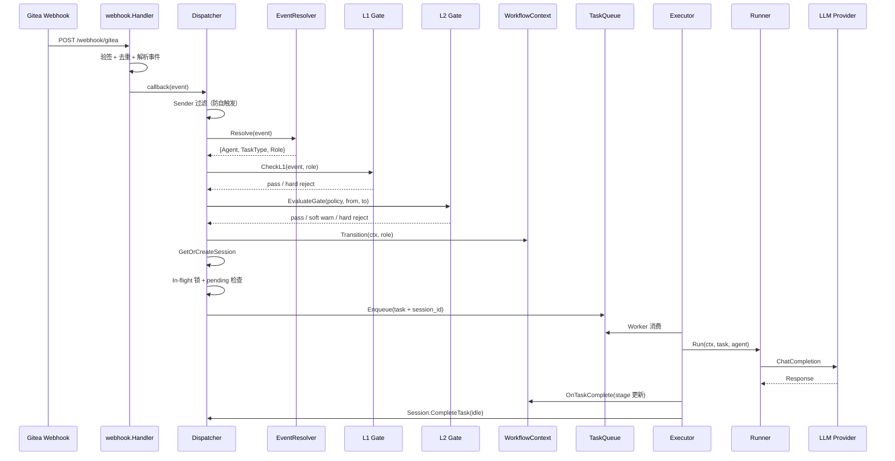
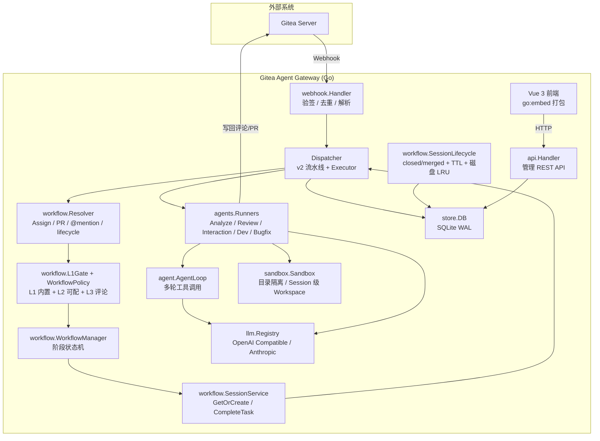
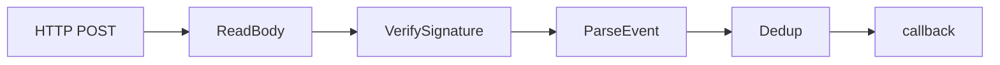
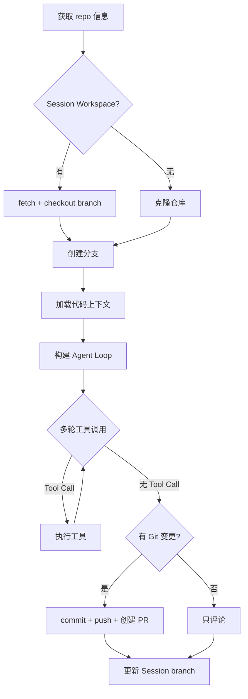
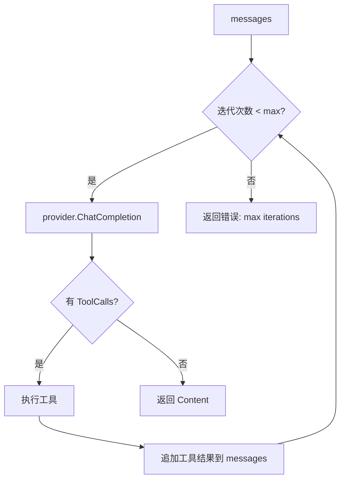
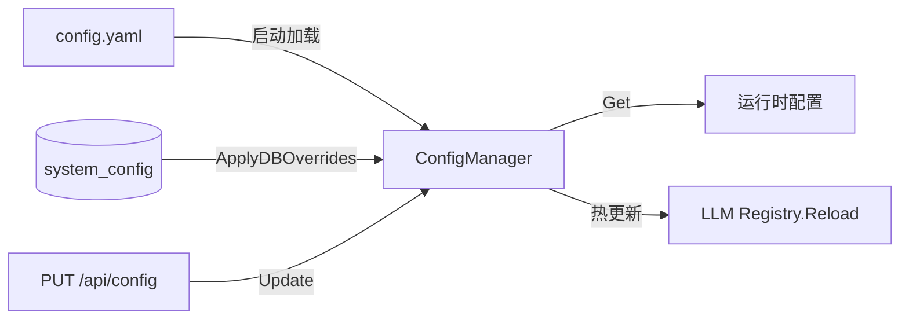

# Gitea Agent Gateway — 技术架构

## 概述

Gitea Agent Gateway 是一个 Go 服务，接收 Gitea Webhook 事件，通过 **Assign Agent** 模型触发 AI Agent，执行 LLM 驱动的任务（分析、审查、开发、修复），并将结果写回 Gitea（评论或创建 PR）。

核心设计原则：
- **Assign 触发 Who，WorkflowContext 定义 When，WorkflowPolicy 定义能不能转，AgentSession 支撑 Continue**
- **Assign 触发** — 在 Issue/PR 上 Assign Agent 即可触发工作流（v2 弃用 Label 触发与 routes 表）
- **功能性 Agent + Role** — 每个 Agent 有 role（analyze/coder/review），决定执行行为
- **WorkflowContext 状态机** — Gateway 维护阶段真相，不从 Gitea 快照推断
- **Session 续作** — @mention 可复用 Session 和 Workspace，支持 PR 上改代码
- **三层门禁** — L1 结构性（内置）、L2 流程性（可配）、L3 建议性（评论）

## 请求流（v2 Assign 模型）



## 组件架构



## 组件详解

### 1. `internal/webhook` — Webhook 入口

**文件**: `handler.go`, `parser.go`, `signature.go`, `dedup.go`



- `Handler.ServeHTTP` 处理 `POST /webhook/gitea`
- 支持 `X-Gitea-Event` / `X-Gitea-Delivery` / `X-Hub-Signature-256` 头部
- `Deduplicator` 通过 SQLite `processed_deliveries` 表去重（delivery_id 唯一）
- `ParseEvent` 将 JSON payload 解析为 `WebhookEvent` 统一结构体，合并 Issue、PR、Comment 等类型
- 异步调用 callback（Dispatcher.HandleEvent），立即返回 `200 {"status":"accepted"}`

### 2. `internal/dispatcher` — 调度核心

**文件**: `dispatcher.go`, `queue.go`, `executor.go`, `template.go`

> v2 已移除 `router.go` 与 `routes` 表依赖；事件路由由 `internal/workflow.Resolver` 完成。

#### Dispatcher.HandleEvent — v2 事件处理流水线

```
WebhookEvent
  → Sender 过滤（sender == 任意 Agent → 忽略，防自触发）
  → /gateway reset 检测（评论命令 → archive + context=idle）
  → EventResolver.Resolve(event)
      ├─ lifecycle（issues.closed / pull_request.closed）→ SessionLifecycle，不入队
      └─ task 事件 → 继续
  → L1 结构性门禁（review 需 PR 等）
  → WorkflowContext.Transition(stage)
  → L2 流程性门禁（EvaluateGate；/force 可跳过 soft）
  → In-flight 锁 + pending Task 检查
  → SessionService.GetOrCreate
  → Enqueue(task + session_id + role)
  → 进度评论（🔄 已开始）
```

启动时 `main.go` 通过 `SetWorkflowComponents` 注入 Registry、Resolver、WorkflowManager、L1Gate、SessionService、WorkflowPolicy、SessionLifecycle；`SessionLifecycle.StartCleanupLoop` 每 10 分钟扫描 idle TTL 与 archived workspace。

#### `internal/workflow` — 工作流引擎

| 模块 | 文件 | 职责 |
|---|---|---|
| EventResolver | `resolver.go` | Assign / PR review / @mention / lifecycle / reset 解析 |
| WorkflowManager | `context.go` | stage 转换 + Task 完成回调 |
| L1Gate | `gate_l1.go` | 结构性 hard 门禁 + Agent 评论模板 |
| WorkflowPolicy | `policy.go` | L2 预设 free/standard/strict + EvaluateGate + L3 模板 |
| SessionService | `session.go` | GetOrCreate、CompleteTask、Archive |
| SessionLifecycle | `lifecycle.go` | closed/merged 归档、TTL、EnforceDiskLimit |

#### EventResolver — Assign 模型解析（`internal/workflow/resolver.go`）

| 事件 | 解析逻辑 | Task Type |
|---|---|---|
| `issues.assigned` | `assignee.login` → Registry → role | analyze: `analyze_issue`, coder: `solve_issue`/`fix_bug`(bug标签), review: 忽略 |
| `pull_request.review_requested` | reviewers 中找 review Agent | `review_pr` |
| `issue_comment` + @mention | 解析 @username → Registry → role；`/dev` `/reply` `/force` | analyze: `reply_comment`, coder: `solve_comment` |
| `issues.closed` | — | lifecycle：context=done，archive sessions |
| `pull_request.closed` | merged → archive + 延迟删 workspace | lifecycle |
| `issues.labeled` | **忽略**（v2 弃用 Label 触发） | — |
| `issues.unassigned` | **忽略**（不回退 stage） | — |

#### WorkflowContext — 阶段状态机（`internal/workflow/context.go`）

```
idle → analyzing → analyzed → developing → reviewing → done
```

- Assign analyze: idle/analyzed/done → analyzing
- Assign coder: idle/analyzed → developing
- PR review_requested → reviewing
- Task 完成回调：analyze→analyzed, solve/fix→developing（写 PR ID）
- Issue closed / PR merged → done + archive sessions（`SessionLifecycle`）
- 评论 `/gateway reset` 或 `POST /api/sessions/reset` → context=idle，archive sessions

#### WorkflowPolicy — 三层门禁（`internal/workflow/policy.go`）

| 层级 | 说明 | 配置 |
|---|---|---|
| L1 结构性 | 无 PR 不能 review、closed PR 拒绝等 | 内置 hard，不可 force 绕过 |
| L2 流程性 | coder_requires_analyzed、reanalyze_while_developing 等 | off/soft/hard；预设 `free` / `standard` / `strict`（`config.workflow.preset`） |
| L3 建议性 | 完成后建议 Assign 下一步 | Agent 评论模板（on_analyze_done 等） |

评论 body 含 `/force` 可在 **soft** 门禁下跳过警告入队；L1 与 hard 不可绕过。

#### TaskQueue — 持久化队列

- 内存 buffer + SQLite 持久化，崩溃恢复
- Scanner: 每 60s 扫描 pending + 重置超时 running（10min）

#### Executor — 并发执行器

- semaphore 控制并发，失败重试
- OnComplete 回调：更新 WorkflowContext stage + `SessionService.CompleteTask`

### 3. `internal/agents` — Runner 策略层

**文件**: `runners.go`, `manager.go`, `registry.go`, `interaction.go`, `prompt.go`

#### Runner 接口

```go
type Runner interface {
    Run(ctx context.Context, task *store.Task, agent *store.Agent) (*Result, error)
}

type Result struct {
    Content    string
    Action     string                 // "comment" | "pr"
    ActionData map[string]interface{}
}
```

#### RunnerFactory

```go
type RunnerFactory struct {
    llmRegistry      *llm.Registry
    giteaFactory     GiteaClientFactory
    sandboxCfg       sandbox.Config
    db               *store.DB
    defaultMaxTokens int     // 默认 4096
    defaultTemp      float64 // 默认 0.3
}
```

工厂方法根据 **task type** 返回 Runner（task type 由 EventResolver 根据 **Agent.role + 事件** 决定，不再经 routes 或 Label 匹配）：
- `analyze_issue` / `trigger` → **AnalyzeRunner**: 单次 LLM 调用，返回评论
- `review_pr` → **ReviewRunner**: 获取 PR diff + 文件列表 → LLM 审查 → 评论
- `reply_comment` → **InteractionRunner**: 获取最近 10 条评论历史 → LLM 回复 → 评论
- `solve_issue` → **DevRunner**: 调用 `runWriteTask(task, agent, factory, "dev")`
- `fix_bug` → **BugfixRunner**: 调用 `runWriteTask(task, agent, factory, "bugfix")`

默认值传播链路：`ConfigManager → Dispatcher → Executor → RunnerFactory → resolveMaxTokens / resolveTemperature`。Agent 的 `MaxTokens`/`Temperature` 设为 0 时，自动使用工厂默认值。

#### runWriteTask（DevRunner / BugfixRunner 共享实现）



**Session 级 Workspace**：coder Task 结束后不 Cleanup，workspace 保留在 `sessions/{session_id}/repo/`。下次 Task 时 fetch + checkout 而非全量 clone，实现续作。

#### Agent Manager

Agent 创建流程：
1. 用 Admin Token 在 Gitea 上创建用户（随机密码）
2. 用该用户的用户名+密码创建 API Token（Gitea 1.26+ 要求）
3. 将 Agent 信息（含 token）存入 SQLite
4. 删除 Agent 时可选择同时删除 Gitea 用户

#### PromptManager

SystemPrompt 加载优先级：
1. **DB prompt_history 表**中 `is_active=1` 的版本（UI 维护的版本历史）
2. Agent 自身 `system_prompt` 字段
3. 配置文件 `agents.templates[taskType].system_prompt`
4. 内置模板（Go 代码中注册的默认 prompt）

### 4. `internal/agent` — Agent Loop（多轮工具调用）

**文件**: `loop.go`, `tools.go`, `context.go`



#### 默认工具箱（DefaultTools）

| 工具 | 作用 |
|---|---|
| `read_file` | 读取工作区文件 |
| `write_file` | 写入/创建文件 |
| `list_files` | 列出目录结构（`find -maxdepth 3`） |
| `search_code` | grep 搜索代码 |
| `run_command` | 执行 shell 命令（构建/测试） |
| `apply_diff` | 应用 unified diff patch |
| `tree` | 显示目录树（可配置深度） |
| `git_log` | Git 提交历史 |
| `git_blame` | 文件行溯源 |

所有工具操作限制在 sandbox 工作区内，通过路径遍历防护。

### 5. `internal/sandbox` — 工作区沙箱

**文件**: `sandbox.go`, `git.go`, `audit.go`

非 Docker 的轻量沙箱：

- **命令白名单**: git, go, python, node, cat, ls, grep 等安全命令
- **路径隔离**: 所有文件操作验证在 `WorkDir` 内，防止 `../../etc/passwd`
- **超时控制**: 单命令 `CommandTimeout`（默认 5m），总任务 `TaskTimeout`（默认 30m）
- **输出限制**: stdout/stderr 各 `MaxOutput`（默认 1MB）
- **文件大小限制**: `MaxFileSize`（默认 1MB）

两种工作区模式：
- **Session 级**（v2 coder 主路径）：`{baseDir}/sessions/{session_id}/repo/`，Task 结束不 Cleanup，生命周期或 reset 时回收
- `fixed`: 固定目录 `baseDir/task_{id}`（无 Session 时的 fallback）
- `temp`: `os.MkdirTemp` 自动创建临时目录

#### Git 操作封装

`Git` 结构体封装了沙箱内的 Git 操作：`Clone`、`CreateBranch`、`Add`、`Commit`、`Push`。
分支名强制以 `ai/` 开头（`ValidateBranchName`），防止注入。

#### Audit Logger

所有命令执行记录到 SQLite `operation_logs` 表，包含：命令、参数、退出码、stdout/stderr 截断、耗时。

### 6. `internal/llm` — LLM Provider 抽象

**文件**: `provider.go`, `registry.go`, `openai.go`, `anthropic.go`

```go
type Provider interface {
    ChatCompletion(ctx context.Context, req *ChatRequest) (*ChatResponse, error)
}
```

#### OpenAICompatibleProvider

兼容 OpenAI API 格式的 provider。支持 DeepSeek、Qwen、Zhipu、Moonshot、Ollama 等。
- 请求 `POST {baseURL}/chat/completions`
- 支持 Tool Calls（function calling 格式）
- 支持 DeepSeek-R1 等推理模型的 `reasoning_content` 字段回退

#### AnthropicProvider

Claude API 的适配器。将 Messages 中的 system role 提取为顶层的 `system` 参数（Anthropic API 格式）。**暂不支持 Tool Calls**。

#### Registry

从配置文件 `llm.providers` 初始化 provider 映射。根据 provider 名称自动选择适配器（Claude/Anthropic 走 AnthropicProvider，其余走 OpenAICompatibleProvider）。支持运行时热重载（config 变更时 `Reload`）。

### 7. `internal/store` — 数据持久层

**文件**: `sqlite.go`, `agent.go`, `task.go`, `workflow.go`, `session.go`, `prompt.go`, `user.go`, `system_config.go`, `log.go`

> v2 已删除 `route.go`；迁移时 `DROP TABLE routes`。

#### 数据库选择

SQLite + WAL 模式。单连接写（`SetMaxOpenConns(1)`），忙等待超时 10s。

#### 表结构

| 表 | 用途 | 关键字段 |
|---|---|---|
| `agents` | AI Agent 配置 | name, gitea_username, **role**, provider, model, repos(JSON), loop_config(JSON), status |
| `workflow_contexts` | Issue 工作流阶段（Gateway 真相） | repo, issue_id, pr_id, stage, active_agent_id, active_role, session_id |
| `agent_sessions` | 跨 Task 会话与 Workspace 元数据 | id(UUID), repo, issue_id, agent_id, role, status, branch, workspace_path, last_task_id |
| `tasks` | 执行任务 | event, repo, issue_id, agent_id, task_type, **session_id**, **role**, status, delivery_id, base_branch |
| `prompt_history` | Prompt 版本管理 | agent_id(FK), system_prompt, user_template, version, is_active |
| `processed_deliveries` | Webhook 去重 | delivery_id(PK) |
| `operation_logs` | 操作审计 | agent_id, task_id, action, detail |
| `users` | 管理后台用户 | username(UNIQUE), password_hash, role, is_active |
| `system_config` | 运行时配置覆盖 + Prompt 模板存储 | key(PK), value |

#### Agent 模型

```go
type Agent struct {
    ID            int64
    Name          string
    GiteaUsername string    // 对应 Gitea 协作者；Assign 时匹配 assignee
    GiteaToken    string    // 写回评论/创建 PR 的凭证
    Role          string    // analyze | coder | review — 决定触发后的 Runner/task_type
    Provider      string    // LLM provider 名称
    Model         string    // 模型名称
    Repos         []string  // 可选：限定 Agent 生效的仓库列表
    MaxTokens     int       // 0 = 使用 RunnerFactory 默认值
    Temperature   float64   // 0 = 使用 RunnerFactory 默认值
    SystemPrompt  string    // Agent 人格
    UserTemplate  string    // 上下文模板
    LoopConfig    *AgentLoopConfig  // Agent 级别的 Loop 配置（覆盖全局）
    Status        string    // "active" | "inactive"
}
```

### 8. `internal/config` — 配置系统

**文件**: `config.go`, `schema.go`, `manager.go`

双层配置：**文件配置（YAML）** + **运行时覆盖（DB system_config 表）**



1. 启动时加载 `config.yaml`，支持 `${ENV_VAR}` 和 `${ENV_VAR:-default}` 环境变量展开
2. 自动填充默认值（host=0.0.0.0, port=8080, 等）
3. `ConfigManager.ApplyDBOverrides()` 从 `system_config` 表加载 key-value 覆盖文件配置
4. 通过 API 更新配置后，LLM Registry 自动热重载

配置优先级：**DB 覆盖 > config.yaml > 硬编码默认值**

v2 相关配置段（见 `config.example.yaml`）：

| 段 | 用途 |
|---|---|
| `workflow.preset` | 工作流门禁预设：`free` / `standard` / `strict` |
| `workflow.gates` | L2 各项门禁 off/soft/hard 覆盖 |
| `session.idle_ttl` | Session 无活动 archive 超时（默认 168h） |
| `session.workspace_retention` | archived 后延迟删 workspace（默认 24h） |
| `session.max_disk_per_repo` | 磁盘 LRU 上限 |

### 9. `internal/gitea` — Gitea API 客户端

**文件**: `client.go`, `issue.go`, `pr.go`, `repo.go`, `admin.go`, `types.go`

- 基于 `net/http` 的轻量客户端，无外部依赖
- API 路径前缀 `/api/v1`
- 认证方式：`Authorization: token {token}`
- 支持：创建/删除用户、Issue CRUD/评论/Label、PR 创建/Diff/文件列表、仓库信息等

### 10. `internal/api` — 管理 REST API

**文件**: `router.go`, `auth.go`, `auth_handler.go`, `config.go`, `prompt_templates.go`

两个认证层：
- **Bearer Token** (`h.auth.Wrap`): 简单 API token，用于 Agent、Task、Session reset、Prompt 管理接口（`api.auth_token` 配置）
- **JWT** (`h.jwtWrap`): 用户登录认证，用于 User 管理、系统配置、Prompt 模板管理接口

API 端点概览：

| 方法 | 路径 | 认证 | 用途 |
|---|---|---|---|
| POST | `/api/auth/login` | 无 | 登录获取 JWT |
| POST | `/api/auth/logout` | 无 | 登出 |
| GET | `/api/auth/me` | JWT | 当前用户信息 |
| PUT | `/api/auth/password` | JWT | 修改密码 |
| GET | `/api/users` | JWT | 用户列表 |
| POST | `/api/users` | JWT | 创建用户 |
| PUT | `/api/users/{id}` | JWT | 更新用户 |
| DELETE | `/api/users/{id}` | JWT | 删除用户 |
| GET | `/api/repos` | JWT | 可关联仓库列表 |
| GET | `/api/agents` | Token | Agent 列表 |
| POST | `/api/agents` | Token | 创建 Agent（含 role、repos） |
| GET | `/api/agents/{id}` | Token | Agent 详情 |
| PUT | `/api/agents/{id}` | Token | 更新 Agent |
| DELETE | `/api/agents/{id}` | Token | 删除 Agent |
| GET | `/api/agents/{id}/tasks` | Token | Agent 的任务列表 |
| GET | `/api/agents/{id}/prompts` | Token | Agent 的 Prompt 版本 |
| POST | `/api/agents/{id}/prompts` | Token | 创建 Prompt 版本 |
| GET | `/api/agents/{id}/prompts/active` | Token | 当前活跃 Prompt |
| POST | `/api/prompts/{id}/activate` | Token | 回滚 Prompt 版本 |
| DELETE | `/api/prompts/{id}` | Token | 删除 Prompt 版本 |
| GET | `/api/tasks` | Token | 任务列表（分页+筛选） |
| GET | `/api/tasks/{id}` | Token | 任务详情 |
| POST | `/api/sessions/reset` | Token | 重置 Issue 工作流（archive sessions + context=idle） |
| GET | `/api/logs` | Token | 操作日志 |
| GET | `/api/stats` | Token | 统计数据 |
| GET | `/api/templates` | Token | 内置模板列表 |
| GET | `/api/config` | JWT | 系统配置 |
| PUT | `/api/config` | JWT | 更新配置覆盖 |
| DELETE | `/api/config/{key}` | JWT | 恢复配置默认值 |
| GET | `/api/prompt-templates` | Token | Prompt 模板列表（内置+自定义） |
| PUT | `/api/prompt-templates` | JWT | 创建/更新自定义 Prompt 模板 |
| DELETE | `/api/prompt-templates/{name}` | JWT | 删除自定义 Prompt 模板 |

> **v2 Breaking**：`/api/routes` 及 `/api/agents/{id}/routes` 已移除。触发方式改为 Gitea 上 **Assign Agent**。

### 11. Web 前端

**技术栈**: Vue 3 + Element Plus + Vue Router + Pinia

页面：
- **Dashboard** — 状态概览、统计数据、新用户引导（创建 Agent → Assign 触发）
- **Agents** — Agent 列表（role 徽章）、创建/编辑（role 选择、Prompt 模板、关联 repos）
- **AgentDetail** — Agent 详情（基本信息含 role、触发规则 Tab 已弃用提示、Prompt 版本历史）
- **Tasks** — 任务列表（服务端分页+筛选：状态/类型/Agent）
- **SystemConfig** — 系统配置（Gitea 连接、LLM 配置、任务调度、Agent 默认参数、Prompt 模板管理）
- **Users** — 管理后台用户 CRUD（客户端分页）
- **Login** — JWT 登录

> v2 已移除独立「触发规则」页面（原 `TriggerRules.vue` 不再挂载路由）。

前端通过嵌入 Go 二进制 (`//go:embed web/dist/*`) 由同一个进程提供静态文件服务。

## 关键设计决策

### 为什么不用 Docker 沙箱？

项目初期评估 Docker 沙箱的开销和复杂度后，选择**目录隔离 + 命令白名单**的轻量方案：
- 更快的启动速度（毫秒级 vs 秒级）
- 无容器运行时依赖
- 足够的安全边界（白名单 + 路径验证 + 超时控制）
- 缺点：缺乏内核级隔离，不适合运行不可信代码

### 为什么 Assign 而不是 Label 触发？（v2）

v1 使用 `routes` 表 + Label 条件匹配，存在路由与 Runner 行为脱节、多 Label/多 Assignee 时阶段不明、无法 Session 续作等问题。v2 改为：

- **Assign / Request Reviewer / @mention** 为唯一触发源；`issues.labeled` 与 `ai:*` 阶段标签 **不再入队**
- **Agent.role**（analyze/coder/review）固定映射 Runner；Issue 业务标签 `bug` 仅影响 coder 的 task_type（`fix_bug` vs `solve_issue`）
- **WorkflowContext** 维护 stage 真相；**AgentSession** 绑定 Workspace 支持 PR 上 @coder 续作
- **WorkflowPolicy** 三层门禁（L1/L2/L3）替代「配 Route 猜行为」

迁移对照见 [archived/20260615-trigger-rules-and-workflow-improvement.md §11.2](./archived/20260615-trigger-rules-and-workflow-improvement.md#112-从-label-触发迁移到-assign)。

### Runner 策略模式

5 种 Runners 共享一个 `RunnerFactory`，但各自的执行逻辑差异大（AnalyzeRunner 是简单 LLM 调用，DevRunner 是多轮 agent loop + git 操作）。策略模式让：
- 新增任务类型只需新增 Runner 实现 + 注册到 `GetRunner`
- 各 Runner 独立测试、独立演进
- 共享依赖（LLM Registry、Gitea Client Factory、Session Workspace）通过 Factory 注入

### Task Type 如何决定？

v2 中 **EventResolver** 根据 `Agent.role` + 事件上下文产出 task_type，不再使用 `Router.Match` 或 Label 分支：

| role | 典型事件 | task_type |
|---|---|---|
| analyze | `issues.assigned` | `analyze_issue` |
| analyze | @mention 评论 | `reply_comment` |
| coder | `issues.assigned`（无 bug 标签） | `solve_issue` |
| coder | `issues.assigned`（含 bug 标签） | `fix_bug` |
| coder | @mention + 有 Session/PR | `solve_comment` |
| review | `pull_request.review_requested` | `review_pr` |

用户配置的是 **谁**（功能性 Agent 账号 + role + Provider），不是 **哪条 Route 规则**。

## 测试架构

- **单元测试**: 各 package 内，测试单个函数/方法，无外部依赖
- **集成测试**: `tests/integration/`，使用 `TestEnv` 提供 in-memory SQLite + mock Gitea 服务 + mock LLM Provider + 完整 HTTP 测试服务器
- **工作流测试**: `tests/integration/workflow_test.go` — 13 项 Assign / @mention / L2 / lifecycle 端到端用例
- 决策规则：需要 TestEnv（DB/HTTP/Mock） → 集成测试；否则 → 单元测试

## 部署

```bash
# 1. 准备配置文件
cp config.example.yaml config.yaml
# 编辑 config.yaml，至少配置 Gitea URL、Admin Token、API Key

# 2. 构建前端（可选，go:embed 打包）
cd web && npm install && npm run build && cd ..

# 3. 构建后端
go build -o gateway .

# 4. 运行
./gateway -config config.yaml

# 5. 在 Gitea 仓库设置中添加 Webhook：
#    URL: http://your-server:8080/webhook/gitea
#    密钥: 与 config.yaml 中的 webhook_secret 一致
#    触发事件: Issues, Pull Requests, Issue Comments
# 6. 在 Gateway 创建 Agent（设置 role），将 Agent 账号加为仓库协作者
# 7. 在 Issue 上 Assign analyze/coder Agent，或在 PR 上 Request Reviewer
```

首次启动自动：
1. 创建 SQLite 数据库并执行迁移（含 `workflow_contexts`、`agent_sessions`；`DROP TABLE routes`）
2. 创建默认 admin 用户
3. 从 `system_config` 表加载配置覆盖
4. 从 DB 加载 pending 任务到队列
5. 启动 Scanner + Workers + SessionLifecycle 清理循环

## 项目文件清单

```
main.go                              # 入口：HTTP 服务、组件组装、优雅关闭
internal/
├── webhook/                         # Webhook 接收
│   ├── handler.go                   #   HTTP Handler（验签/去重/解析/回调）
│   ├── parser.go                    #   事件类型定义 + JSON 解析
│   ├── signature.go                 #   HMAC-SHA256 签名验证
│   └── dedup.go                     #   delivery_id 去重
├── dispatcher/                      # 调度核心
│   ├── dispatcher.go                #   v2 流水线（Resolver→Gate→Session→Queue）
│   ├── queue.go                     #   持久化任务队列（chan+SQLite）
│   ├── executor.go                  #   并发执行器（worker+重试+写回+OnComplete）
│   └── template.go                  #   模板渲染引擎
├── workflow/                        # v2 工作流引擎
│   ├── resolver.go                  #   Event Resolver（Assign/PR/@mention/lifecycle）
│   ├── context.go                   #   WorkflowContext 状态机
│   ├── gate_l1.go                   #   L1 结构性门禁
│   ├── policy.go                    #   L2/L3 WorkflowPolicy
│   ├── session.go                   #   SessionService
│   └── lifecycle.go                 #   TTL 清理 + 磁盘 LRU
├── agents/                          # Runner 策略层
│   ├── runners.go                   #   Runner 接口 + 5 种实现 + Factory
│   ├── manager.go                   #   Agent 生命周期（Gitea 账号创建）
│   ├── registry.go                  #   Agent 内存注册表（快速查找）
│   ├── interaction.go              #    @Mention 检测
│   └── prompt.go                    #   Prompt 管理器（DB→Agent→Config→内置）
├── agent/                           # Agent Loop
│   ├── loop.go                      #   多轮工具调用循环
│   ├── tools.go                     #   Tool 注册 + 默认工具集（9 个工具）
│   └── context.go                   #   代码上下文加载
├── llm/                             # LLM 抽象层
│   ├── provider.go                  #   Provider 接口 + 类型定义
│   ├── registry.go                  #   Provider 注册表（含 Reload 热重载）
│   ├── openai.go                    #   OpenAI 兼容 API 客户端
│   └── anthropic.go                 #   Claude API 客户端
├── sandbox/                         # 工作区沙箱
│   ├── sandbox.go                   #   目录隔离 + 命令白名单 + 文件操作
│   ├── git.go                       #   Git 操作封装
│   └── audit.go                     #   命令审计日志
├── gitea/                           # Gitea API 客户端
│   ├── client.go                    #   HTTP 客户端（do 方法）
│   ├── issue.go                     #   Issue 操作
│   ├── pr.go                        #   PR 操作
│   ├── repo.go                      #   仓库操作
│   ├── admin.go                     #   管理员操作（创建/删除用户）
│   └── types.go                     #   共享类型
├── store/                           # 数据持久层
│   ├── sqlite.go                    #   SQLite 连接 + 迁移
│   ├── agent.go                     #   Agent CRUD（含 role）
│   ├── workflow.go                  #   WorkflowContext CRUD
│   ├── session.go                   #   AgentSession CRUD
│   ├── task.go                      #   Task CRUD + 筛选 + 分页
│   ├── prompt.go                    #   Prompt 版本管理
│   ├── user.go                      #   用户 CRUD
│   ├── system_config.go             #   运行时配置覆盖
│   └── log.go                       #   操作日志
├── api/                             # 管理 REST API
│   ├── router.go                    #   路由注册 + handler 实现
│   ├── auth.go                      #   Bearer Token 中间件
│   ├── auth_handler.go              #   JWT 登录接口
│   ├── config.go                    #   系统配置 API（含 key 校验）
│   └── prompt_templates.go          #   Prompt 模板 API
├── config/                          # 配置系统
│   ├── schema.go                    #   配置结构体定义
│   ├── config.go                    #   YAML 加载 + 环境变量展开 + 默认值
│   └── manager.go                   #   配置管理器（文件 + DB 覆盖 + 热更新）
└── auth/                            # 认证
    ├── jwt.go                       #   JWT 创建/验证
    └── password.go                  #   密码哈希（bcrypt）

web/src/                             # Vue 3 前端
├── App.vue, main.js                  # 入口
├── views/                            # 页面组件
│   ├── Dashboard.vue                 #   仪表盘 + 新用户引导
│   ├── Agents.vue                    #   Agent 列表 + 创建/编辑（role）
│   ├── AgentDetail.vue               #   Agent 详情 + 弃用提示 + Prompt 版本
│   ├── Tasks.vue                     #   任务列表（服务端分页+筛选）
│   ├── SystemConfig.vue              #   系统配置（5 个标签页）
│   ├── Users.vue                     #   用户管理
│   └── Login.vue                     #   登录
├── components/                       # 共享组件
│   ├── Layout.vue                    #   布局框架 + 导航菜单
│   └── TemplateHelp.vue              #   模板变量说明弹窗
└── router/                           # 路由
    └── index.js
```
