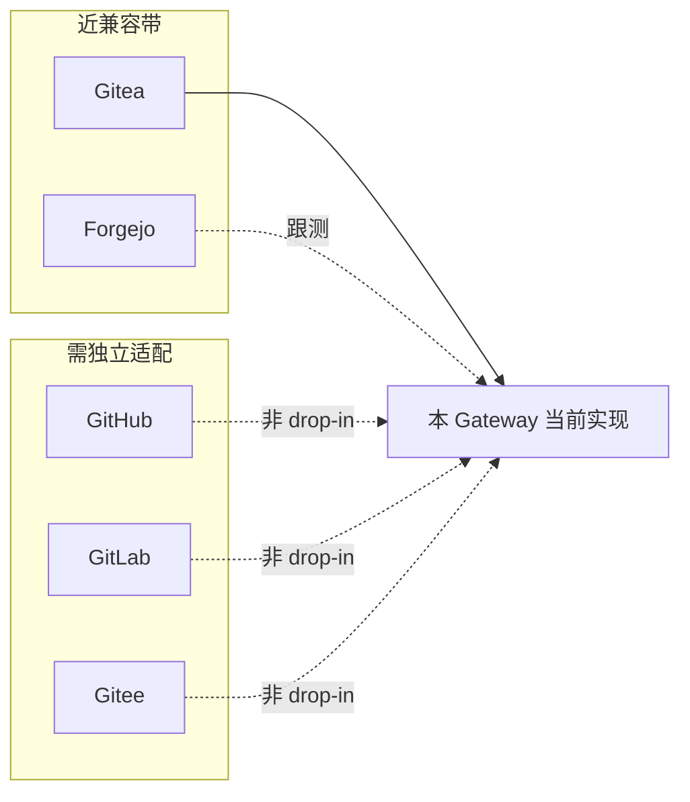

# Coding Gateway 平台策略（Gitea 优先）

> 状态：**已归档决策**（2026-07-14 确认）  
> 日期：2026-07-14  
> 相关：[server-runtime-design-v4](../server-runtime-design-v4.md) · [agent-development-decisions](./20260601-agent-development-decisions.md)  
> 参考实现：`x:\ai-git-bot`、`x:\wshm`（借鉴边界，不照搬多平台范围）
>
> **冻结结论**：面向中小团队，深度做好 Gitea（Forgejo 跟测）；不立项 GitHub/GitLab/Gitee 多平台抽象；Issue 级目标分支不做。后续实现围绕 Gitea 深化。

## 概述

面向**中小型开发团队**重新评估后：

1. **Issue 级任意目标分支** → 边缘场景，**不做**  
2. **GitHub / GitLab / Gitee 多平台抽象** → 现阶段**没有必要立项**  
3. **产品主线** → **深度做好 Gitea**（Forgejo 作为近兼容跟测）；多平台留到有真实客户需求再做

---

## 1. 要不要支持第三方平台？

### 结论：现阶段重点只支持 Gitea，不抽通用 Host SPI

| 维度 | 判断 |
|------|------|
| 目标用户 | 中小团队常见自建 **Gitea / Forgejo**，要内网可控、少绑定大厂 SaaS |
| 竞品挤压 | GitHub 有 Copilot / Coding Agent；GitLab 有 Duo；在其平台再做一个「通用 gateway」获客难、App/权限成本高 |
| 工程 ROI | 真正成本在 webhook 验签、事件模型、鉴权与 **Bot 账号供给**，不是换 HTTP client |
| 现有资产 | 已深度绑定 Gitea（`/webhook/gitea`、Admin 建用户发 token、协作者）——这是差异化 |

**Forgejo**：Gitea hard-fork，API/webhook 同源度高；作为**同一实现的兼容跟测**，不算单独产品线。

**何时再谈多平台：** 出现明确生产客户必须对接 GitHub Enterprise / 自建 GitLab 等；届时按 adapter 立项，而不是预先上大 SPI（避免 wshm「trait 在、主路径旁路」）。

---

## 2. Webhook / API 能否与当前 Gitea 接口「全面兼容」？

**兼容标准：** 现有 `POST /webhook/gitea` + `internal/gitea` 客户端，对另一平台 **零改或极少改** 即可接收并写回。

### 2.1 兼容矩阵

| 平台 | Webhook vs 本项目 | REST / 写回 vs 本项目 | 能否 drop-in |
|------|-------------------|----------------------|--------------|
| **Gitea** | `X-Gitea-Signature`（裸 hex HMAC-SHA256）、`X-Gitea-Event`、`X-Gitea-Delivery`；含本项目已做的 Gitea 特有归一化（如 `issue_assign`→`issues`） | `/api/v1` + `Authorization: token`；**Admin 建用户 / 发 token / 加协作者** | ✅ 唯一完整面 |
| **Forgejo** | 同系 header / payload（需按版本跟测） | 同系 `/api/v1` | 🟡 跟测目标，不另开产品 |
| **GitHub** | 主用 `X-Hub-Signature-256`（`sha256=` 前缀）、`X-GitHub-Event` / `X-GitHub-Delivery`；payload 为 GitHub 规范 | REST 形似，鉴权多为 Bearer / **GitHub App**；**无对等 Admin 建 bot 用户流** | ❌ 非兼容 |
| **GitLab** | `X-Gitlab-Token`（或签名）；body 为 `object_kind` + `object_attributes`，MR 而非 PR | API v4，路径与术语独立 | ❌ 模型不同 |
| **Gitee** | 自有 `hook_name`、body 内 `password` / `sign`（常见 Base64）等，与 GH/Gitea 均不同 | OpenAPI 有差异与额度限制；企业版字段分化 | ❌ 需独立适配 |

### 2.2 易混淆点：Gitea「兼容 GitHub」≠ 本 Gateway「兼容 GitHub」

Gitea **作为发送方**会附带：

- `X-GitHub-Delivery` / `X-GitHub-Event`
- `X-Hub-Signature-256: sha256=...`

这是为了方便**已经按 GitHub 写好的接收端**也能吃 Gitea 事件。

本项目是 **只校验 / 只读取 `X-Gitea-*` 的接收端**，因此：

- 并不会因为 Gitea 发了 GitHub 兼容头，就自动能收真·GitHub；
- issues / PR JSON「像 GitHub」，但存在 Gitea 特有事件与字段差异，**不能假设 body 字节级一致**。

### 2.3 REST 写回耦合点（比 webhook 更贵）

本项目主路径调用包括：`GetRepo`、`IssueComment`、`CreatePR`、`FindOpenPRByHead`、`PRDiff`、`IssueComments` 等——与 GitHub REST **形似、非等价**。

更硬的差异在 Agent 供给（`internal/agents/manager.go`）：

- Gitea：**Admin API 自动建用户 → 发 token → 加仓库协作者**
- GitHub / GitLab / Gitee：**没有对等一键路径**（需 GitHub App、预置机器用户、Project Access Token 等）

多平台时这一块通常比「换 CreatePR URL」更贵。

### 2.4 与参考项目对照

| 项目 | 多平台姿态 | 对本决策的启示 |
|------|------------|----------------|
| **ai-git-bot** | 四 Git 主机 SPI 齐全，且接到主路径 | 真要多平台可抄接线方式；但对中小团队 + Gitea 自建，**不必为对齐而对齐** |
| **wshm** | `GitProvider` trait 声明多 forge，OSS 主路径仍绑 GitHub | **忌半成品抽象**；没有第二平台需求就不要先抽接口 |

---

## 3. 仍成立的取舍（与平台无关）

### 3.1 Issue 指定目标分支 — 不做

| 维度 | 判断 |
|------|------|
| Coding-gateway | Issue 上用 label/body 指定任意 PR base 极少见刚需 |
| wshm | 仅仓库级 `fix.base_branch` |
| ai-git-bot | 文档有 `issue.ref`，Gitea webhook 映射并不完整 |

**保留通用能力（不是 Issue 级解析）：**

- `CreatePR(head, base)` 显式传参  
- `base = 仓库 default_branch`（后续若需要，可加**仓库级配置覆盖**，对齐 wshm）  
- 续作 `HeadRef` = 现有 `Task.BaseBranch` / `Session.Branch`（工作分支，**不是** PR base）

### 3.2 产品是什么 / 不是什么

| 是 | 不是 |
|----|------|
| Gitea（Forgejo）上的 Agent 编排与写回 | 再造完整 Coding IDE |
| 可配置多角色 Agent + 可选 OpenCode coder | 强制绑定大厂 SaaS 才能用 |
| 中小团队可自托管的 coding gateway | 当下就要做成「GitHub+GitLab+Gitee 通用网关」 |

---

## 4. 对「通用 Host SPI」路线的调整

| 此前设想 | 修订后 |
|----------|--------|
| Phase A 立即抽 `internal/vcs.Host` + `NormalizedEvent` | **降级**：无第二平台客户前不做大抽象 |
| Phase B GitHub / Phase C 多租户 | **远期 backlog** |
| Gitea 打磨 | **当前主线**：稳定性、Agent 供给、Session、写任务、OpenCode、部署体验 |

若未来做第二平台：**优先 GitHub**（生态与 payload 最接近），成本和 GitLab/Gitee 比对更低；仍需独立 webhook handler + 非 Admin 的 Bot 供给，预计额外约 1–2 人周（在边界清晰之后）。

---

## 5. 当前推荐里程碑

1. **文档冻结本决策**：Gitea-first；Forgejo 跟测；GitHub/GitLab/Gitee 非目标；Issue 级 base 不做  
2. **深化 Gitea 路径**：事件覆盖、写回正确性、门禁/Session、OpenCode 可选接入（见 [server-runtime-design-v4](../server-runtime-design-v4.md)）  
3. **可选**：仓库级 `base_branch` 配置（替代仓库 default，仍非 Issue 解析）  
4. **明确不做**：多 Host SPI 预埋、Gitee/GitLab adapter、Issue 目标分支约定  

---

## 6. 决策摘要

1. **面向中小团队 → 重点支持 Gitea（Forgejo 跟测），暂不抽象 GitHub / GitLab / Gitee。**  
2. **Webhook / API 不能与上述第三方平台全面兼容**；仅与 GitHub「形似」，与 GitLab / Gitee「模型不同」；Gitea 发出的 GitHub 兼容头不能反证本项目可接收 GitHub。  
3. **通用 coding-gateway SPI 推迟**到有真实第二平台需求再做。  
4. **Issue 指定目标分支仍为边缘，不做。**
