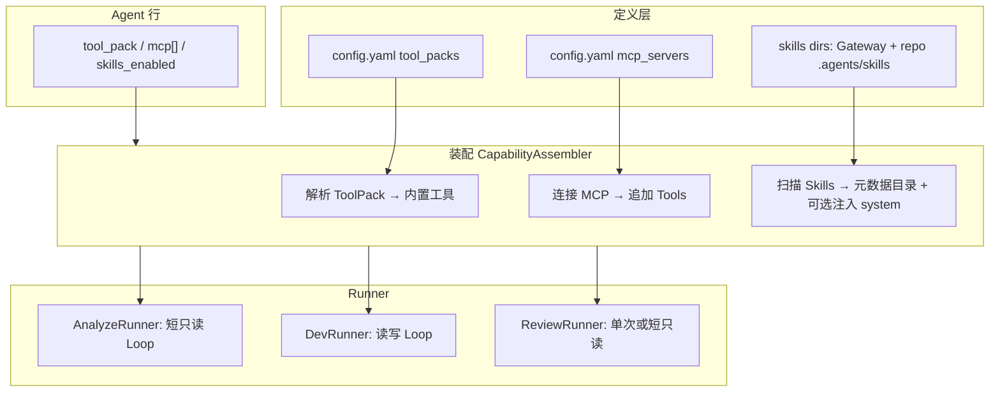

# Internal Agent 能力扩展：ToolPack / MCP / Skills，以及 Analyze 仓库检索

> **状态：已归档（2026-07-23）**  
> ToolPack/MCP/Skills/Analyze 设计已落地；现行行为见 ../ARCHITECTURE.md  
> 现行文档入口：[../TASKS.md](../TASKS.md) · [../ARCHITECTURE.md](../ARCHITECTURE.md) · [../DEPLOYMENT.md](../DEPLOYMENT.md)

---
> 状态：决策稿（可落地）  
> 日期：2026-07-14  
> 范围：**仅 `backend=internal` 的 AgentLoop**；OpenCode 路径不替代托管 MCP/Skills（见 §7）  
> 相关：[server-runtime-design-v4](../server-runtime-design-v4.md) · [todo-20260714-opencode-path-a](20260714-todo-opencode-path-a.md) · [llm-prompt-design](20260531-llm-prompt-design.md)  
> 标准参考：[Agent Skills Specification](https://agentskills.io/specification)

---

## 1. 决策摘要

| 项 | 决定 |
|----|------|
| Skills 形态 | **文件型**：目录 + `SKILL.md`（YAML frontmatter + Markdown），可带 `scripts/` / `references/` / `assets/` |
| Skills 加载 | 运行时扫描；**渐进披露**（先 name/description，命中后再读全文与资源） |
| 落地顺序 | ① ToolPack 引用 → ② 远程 MCP → ToolRegistry → ③ 扫描注入 Skills |
| Analyze 读仓 | **短只读 AgentLoop** + `analyze-readonly` ToolPack（推荐默认）；不靠单次 LLM「猜仓库」 |
| 挂载位置 | ToolPack / MCP / Skills 一律在 **Runner 装配 ToolRegistry / SystemPrompt 时**；不进 Webhook / Dispatcher |
| 非目标 | 多 Git 托管抽象；Gateway 反向做成 MCP Server（后置）；Path A OpenCode 阻塞本方案 |

---

## 2. 现状与缺口

| Runner | 现状 | 与本方案关系 |
|--------|------|--------------|
| **AnalyzeRunner** | **短只读 AgentLoop**（浅 clone + `analyze-readonly`）；clone 失败降级单次 LLM | 已落地（P1.5） |
| **ReviewRunner** | 单次 LLM；上下文含 PR diff / files（Gitea API） | 已有变更面；可选后续挂只读 ToolPack 深挖，P2 |
| **Dev / Bugfix** | 多轮 `AgentLoop` + `DefaultTools(sb)`（写死） | ToolPack/MCP/Skills 的第一受益方 |

已有积木：`internal/agent.AgentLoop`、`ToolRegistry`、`DefaultTools`、`sandbox`、Gitea `GetFileContent`（API 预读兜底）。

---

## 3. 概念与挂载点



**不挂载**：`webhook`、`dispatcher`、`workflow` 门禁——它们只决定「谁跑」；工具与 Skill 属于「怎么跑」。

---

## 4. ToolPack（第一步）

### 4.1 目标

把 `DefaultTools(sb)` 硬编码改为：**命名包 + Agent 引用**。

### 4.2 建议内置包

| Pack ID | 工具（建议） | 用于 |
|---------|--------------|------|
| `analyze-readonly` | `list_files`, `rg`, `search_code`, `read_file`, `tree`, `git_log`（可选 `git_blame`） | Analyze 短 Loop；**禁止** `write_file` / `apply_diff` / `run_command` |
| `coder-default` | 现行 DefaultTools 全集 | Dev / Bugfix |
| `review-readonly` | 同 analyze 或 + 读单文件 | Review 深挖（可选） |

`run_command` 默认 **不进** analyze：避免分析任务变成任意命令执行面；若未来需要 `go list` 等，再开「受限命令白名单 pack」。

### 4.3 配置与 Agent 字段

```yaml
agents:
  tool_packs:
    analyze-readonly:
      tools: [list_files, rg, search_code, read_file, tree, git_log]
    coder-default:
      tools: [read_file, write_file, list_files, search_code, rg, run_command, apply_diff, tree, git_log, git_blame]
```

```text
agents.tool_pack TEXT  -- 默认按 role：analyze→analyze-readonly，coder→coder-default
```

装配入口：`AssembleToolRegistry(packID, sandbox) (*ToolRegistry, error)`，写任务与 Analyze 共用。

---

## 5. 远程 MCP（第二步）

- 定义在 `config.yaml`（URL / 鉴权 / 超时），与 `llm.providers` 同级运维面。  
- Agent 行启用：`mcp_servers: ["name1", ...]`。  
- 实现：MCP tools **合并进** 同一 `ToolRegistry`，仍由 `AgentLoop` 调用。  
- **远程优先**；stdio 本机可选后置。  
- Analyze：仅允许标注为只读的 MCP（或全局策略：analyze role 拒绝带 write 语义的 server）。

---

## 6. 文件型 Skills（第三步）

### 6.1 形态（对齐 agentskills.io）

```text
my-skill/
├── SKILL.md          # 必需：YAML frontmatter + 指令
├── scripts/          # 可选
├── references/
└── assets/
```

`SKILL.md` frontmatter 至少：`name`、`description`；可选 `license`、`compatibility`、`metadata`、`allowed-tools`。

### 6.2 扫描根（建议优先级）

1. **Gateway 全局**：`{gateway_data}/skills/` 或配置 `agents.skills_dirs`  
2. **仓库内**（克隆后）：例如 `.agents/skills/`、`.github/skills/`（可配置；存在则合并）  
3. Agent 可 `skills: ["go-review", ...]` **白名单**；空 = 仅发现元数据、按 description 由模型/启发式激活（渐进披露）

### 6.3 注入方式（渐进披露）

1. **Discovery**：启动/任务开始时只加载各 Skill 的 `name` + `description`（可进 system 附录「可用 Skills 目录」）。  
2. **Activation**：模型调用内置工具 `load_skill(name)`，或匹配规则命中后，读入 `SKILL.md` 正文。  
3. **Execution**：按正文执行；需要时再读 `references/` / 跑 `scripts/`（scripts 必须经 sandbox 白名单，**Analyze 默认禁止任意脚本** 或仅允许声明的只读脚本）。

Skill **不是**第三套 Runtime；仍是 Prompt +（通过 `allowed-tools` / ToolPack）约束工具。

---

## 7. 与 OpenCode（Path A）边界

| 能力 | `backend=internal` | `backend=opencode-*` |
|------|--------------------|----------------------|
| ToolPack / MCP | Gateway 装配进 Loop | **默认不注入** OpenCode（避免双份工具） |
| Skills（仓库内） | Gateway 扫描并披露 | 可把 **发现列表** 写入交给 OpenCode 的 prompt；完整 MCP 仍归 OpenCode 自管 |
| Skills（Gateway 目录） | 注入 Loop | 可选拼进 system；不强制 |

Path A **不阻塞**本方案；Analyze 永远强制 `internal`，故 Analyze 读仓 **只走本文**，不依赖 OpenCode。

---

## 8. Issue Analyze：仓库检索 —— 放哪、怎么做

### 8.1 问题

当前 Analyze = 单次 LLM + Issue 文本 → **看不到仓库**，只能空谈架构猜测。目标：在有限轮次内让模型 **定位相关文件并引用路径/片段**，输出仍是 Issue 评论（不建 PR、不改代码）。

### 8.2 方案对比

| 方案 | 做法 | 优点 | 缺点 |
|------|------|------|------|
| **A. 短只读 AgentLoop（推荐）** | AnalyzeRunner 浅 clone → `ToolPack=analyze-readonly` → `AgentLoop`（`max_iterations` 小，如 5–8） | 与 coder 共用工具栈；检索灵活；贴合 Skills/MCP 演进 | 每次分析有 clone/磁盘成本 |
| B. API 预取拼 context | Runner 用 Gitea Contents/Tree API + 启发式选文件，单次 LLM | 无本地 sandbox | 检索弱；大仓易爆 token；难复用 Skills 脚本 |
| C. 混合 | 先树摘要/关键词 API，不够再短 Loop | 省部分 clone | 实现与策略复杂，两套真相 |

### 8.3 推荐落地（方案 A）——功能点位置

```text
AnalyzeRunner.Run
  ├─ resolveRef = default_branch（或仓库级配置；不做 Issue 级 base）
  ├─ prepareAnalyzeWorkspace()     # 浅 clone --branch ref（可复用 CloneBranch）
  │     workspace: task 级临时目录即可（Analyze 无 Session 续作写码）
  ├─ AssembleToolRegistry("analyze-readonly", sb)
  ├─ optional: Skill discovery（analyze 相关 skills）
  ├─ AgentLoop.Run(system, user=task.Context, max_iter=短)
  ├─ Result → comment（现有 writeback）
  └─ cleanup workspace（成功可删；失败可留审计）
```

| 功能点 | 放置位置 | 说明 |
|--------|----------|------|
| 是否启用读仓 Loop | `AnalyzeRunner` + Agent/role 配置 | 例如 `analyze.mode: single_shot \| short_loop`；默认可先 `short_loop` |
| 浅 clone / 清理 | `internal/agents` helper（与将来 `prepareWriteWorkspace` 对齐，但 **不提交/不建分支**） | 不要塞进 dispatcher |
| 只读工具集 | ToolPack `analyze-readonly` | 与 coder 包隔离，安全边界清晰 |
| Loop 轮次/超时 | `Agent.loop_config` 或 role 默认覆写 | Analyze 默认更短、更便宜 |
| Skills | 扫描 + 短 Loop 内 `load_skill` | 例：`issue-triage`、`golang-layout` |
| MCP | 可选只读 server | 第二步后再开 |
| 评论落盘 | 现有 Executor writeback | 不变 |

**明确不做（Analyze）**：`write_file` / `apply_diff` / 随意 `run_command`、创建分支与 PR、占用 coder Session workspace。

### 8.4 Review 的关系

Review 已有 diff 上下文；**第一期不强制**改 Loop。若 Analyze 短 Loop 稳定，可复用同一 helper 给 Review 作「点名读文件」增强（P2）。

### 8.5 成本与配额

- 浅 clone + 5–8 轮工具：明显高于单次 LLM，属可接受的分析质量成本。  
- 配置：`analyze.max_iterations`、`analyze.clone_timeout`、失败时降级（可选：`fallback_single_shot: true` 仅基于 Issue 文本出弱分析并在评论注明「未能克隆仓库」）。

---

## 9. 落地顺序（确认）

1. **ToolPack**：配置 + Agent 字段 + `AssembleToolRegistry`；coder 行为零回归。  
2. **Analyze 短只读 Loop**（可与 1 同一里程碑后半段）：依赖 `analyze-readonly` pack + 浅 clone helper。  
3. **远程 MCP → ToolRegistry**。  
4. **文件型 Skills 扫描与渐进披露**（含 `load_skill` 工具）。  

OpenCode Path A 与本方案 **正交**；建议 Path A 的 A2 写路径抽取时，顺带抽出「只读 prepare」接口形状，避免两套 clone 逻辑。

---

## 10. 验收标准（摘要）

> 本机 E2E 已覆盖（见 [20260716-e2e-test-report.md](20260716-e2e-test-report.md)）；下列与 E2/E3/E4 对齐。

**ToolPack**

- [x] coder 指定 `coder-default` 与今日 DefaultTools 行为一致  
- [x] analyze 无法调用写工具（registry 层拒绝）

**Analyze 短 Loop**

- [x] Assign analyze → 评论中出现 **真实仓库路径/符号**（非纯臆测）  
- [x] 工作区无新分支推送；无 PR  
- [x] clone 失败时行为符合配置（失败注释或可选弱降级）

**Skills**

- [x] 能发现 Gateway 目录与仓库内 `SKILL.md` 的 name/description  
- [x] 激活后正文进入上下文；未激活不占满 token  

**MCP**

- [x] 远程 server 工具出现在 Loop 可调列表；鉴权失败可读  

---

## 11. 开放细节（实现时再钉）

1. 仓库 Skills 根路径最终名单（`.agents/skills` vs 多根）。  
2. Analyze 是否允许极少数只读脚本（Skill `scripts/`）。  
3. `load_skill` 是否对 Analyze/coder 共用同一工具名。  

以上不影响 §1 / §8 / §9 的主决策。
