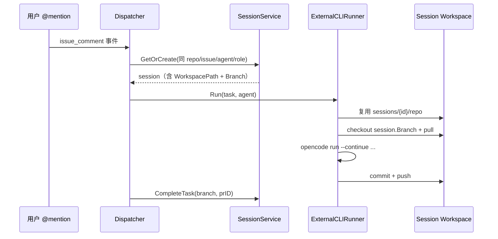

# 服务器端 Agent 运行时设计（Server Runtime Design）v3

> 状态：设计草案 v3  
> 目标：在 v2 长期运行时愿景之上，明确 **编排层 vs 运行时** 边界，并以 **ExternalCLIRunner 最小改动** 优先接入 OpenCode（其次 Claude Code）。  
> 部署目标：Linux / Windows（Host 模式）。定位：个人/小团队自用，最终开源。  
> 前身：[server-runtime-design-v2.md](./server-runtime-design-v2.md)（v2）

---

## 0. 变更记录（v2 → v3）

| 类别 | v2 | v3 |
|------|----|----|
| 分层边界 | 六层 Runtime 平铺，未区分 Gateway 编排 | **新增编排层（Orchestration）与运行时（Runtime）双层模型**，Runtime 不吞 Workflow 职责 |
| Phase 1 | worktree + HostProvider + Scheduler 捆绑 | **拆为 Track A（MVP 接入）与 Track B（基础设施）**；外部 Agent MVP 提前 |
| 外部 Agent | Phase 4 才写 OpenCode | **Phase 1A 优先 OpenCode CLI**，Claude Code 为 Phase 1B |
| Workspace | worktree 与 Session 未说明关系 | **显式定义 Session 固定目录 vs worktree 并发优化** 的共存策略 |
| 实施粒度 | 包级接口为主 | **新增 ExternalCLIRunner 文件级最小改动清单**（可直接开工） |
| 命名 | `Provider` 与 `llm.Provider` 易混淆 | Runtime 执行层改称 **`ExecutionBackend`**（文档内）；代码过渡期可用 `runtime.Backend` |

---

## 1. 背景与问题

v2 正确识别了长期方向：可复现环境、并发调度、项目记忆、可插拔 Agent。但对照当前代码（v2 Assign 模型已落地），存在三个落地 gap：

1. **编排已有、运行时未抽象**：`workflow.SessionService`、`runWriteTask`、Gitea 回写已成熟；若按 v2 Phase 1 先做 worktree + HostProvider，会延迟 **OpenCode 接入**（已在 [todo-20260710-opencode-integration.md](./todo-20260710-opencode-integration.md) 标为高优先级）。
2. **Session Continue 是产品核心**：PR 上 @mention 改代码依赖 Session 级固定 workspace；worktree 是并发优化，不能替换 Session 语义。
3. **Agent 仍是进程内 Loop**：`agent.AgentLoop` 阻塞执行，无法 spawn `opencode` / `claude` CLI。

v3 策略：**先薄层接入外部 CLI（复用现有 git 流程），再渐进抽取 Runtime 抽象。**

---

## 2. 双层架构：编排层 vs 运行时

### 2.1 职责分界

```
┌─────────────────────────────────────────────────────────────────────────┐
│  Orchestration Layer（编排层 — Gateway 已有，继续演进）                    │
│                                                                         │
│  webhook → dispatcher → workflow.Resolver                               │
│         → L1/L2 Gate → WorkflowContext 状态机                           │
│         → SessionService（GetOrCreate / CompleteTask / Archive）        │
│         → TaskQueue → Executor（并发、重试、回写）                        │
│         → Runner 选择（Analyze / Dev / ExternalCLI …）                  │
│                                                                         │
│  拥有：事件语义、阶段转换、Session 生命周期、Gitea 评论/PR、任务幂等        │
└───────────────────────────────┬─────────────────────────────────────────┘
                                │ Runner.Run(ctx, task, agent)
                                │ 只传递：Task + Agent + SessionID + Prompt
                                ▼
┌─────────────────────────────────────────────────────────────────────────┐
│  Runtime Layer（运行时 — v3 渐进引入，不替代编排）                         │
│                                                                         │
│  Workspace 准备（Session 目录 / 未来 worktree）                           │
│  → 依赖安装（未来 InstallDeps）                                         │
│  → Agent 执行（Builtin Loop | External CLI | 未来 AgentRuntime）        │
│  → Git finalize（commit / push — 仍由 Runner 编排，或通过共享 helper）    │
│                                                                         │
│  拥有：目录隔离、命令执行、外部进程生命周期、环境一致性（远期）             │
└─────────────────────────────────────────────────────────────────────────┘
```

### 2.2 编排层不得下沉到 Runtime 的职责

| 职责 | 归属 | 现有实现 |
|------|------|----------|
| Webhook 验签、去重 | 编排 | `internal/webhook` |
| Assign / @mention 解析 | 编排 | `internal/workflow/resolver.go` |
| Workflow 阶段转换 | 编排 | `internal/workflow/manager.go` |
| Session 创建与 TTL/LRU | 编排 | `internal/workflow/session.go`, `lifecycle.go` |
| 任务入队、重试、并发上限 | 编排 | `internal/dispatcher` |
| Gitea 评论 / PR 创建 | 编排 | `executor.writeBackToGitea`, `finalizeWriteTaskPR` |
| in-flight 锁、pending 检查 | 编排 | `internal/dispatcher/dispatcher.go` |

### 2.3 Runtime 不得上收编排的职责

| 反模式 | 正确做法 |
|--------|----------|
| Runtime 内直接 PostComment | Executor / Runner 完成后由编排层回写 |
| Runtime 解析 Webhook payload | 编排层写入 `task.Context`，Runtime 只消费 prompt |
| Runtime 管理 Session 状态机 | SessionService 更新 idle/active；Runtime 只读写 workspace 路径 |
| Provider 决定 task 是否可执行 | Scheduler + Workflow Gate 已决定；Runtime 只执行 |

### 2.4 Runner 是两层交界点

`agents.Runner` 接口保持不变，是 **编排层调用运行时的唯一窄接口**：

```go
type Runner interface {
    Run(ctx context.Context, task *store.Task, agent *store.Agent) (*Result, error)
}
```

ExternalCLIRunner 与 DevRunner **并列**，而非替换整个 Executor 流水线。

---

## 3. Session Workspace vs Worktree：共存策略

### 3.1 两种 Workspace 模式解决不同问题

| 模式 | 目的 | 目录形态 | 生命周期 | 当前状态 |
|------|------|----------|----------|----------|
| **Session Workspace** | Continue：同 Issue/PR 多轮改代码 | `{base_dir}/sessions/{session_id}/repo` 固定路径 | 随 Session TTL + LRU；coder role 创建 | ✅ 已上线 |
| **Task Worktree** | 并发：多任务共享 bare mirror，省磁盘 | `{base_dir}/worktrees/{task_id}/repo` | 任务完成即 remove | 📋 Track B |

**核心原则：Session 语义优先于 worktree 优化。**

### 3.2 决策规则（v3 显式定义）

```
任务到达 DevRunner / ExternalCLIRunner
    │
    ├─ task.SessionID != "" 且 session.WorkspacePath != "" ?
    │       YES → 【Session 模式】
    │              使用 session.WorkspacePath（现有 runWriteTask 逻辑）
    │              禁止为该 Session 再建独立 worktree
    │              同一 Session 内分支由 session.Branch 跟踪
    │
    └─ NO（无 Session 或 analyze 等只读任务）
            → 【Task 模式 — 当前】
                 task 级 sandbox 目录 或 temp clone
            → 【Task 模式 — Track B 未来】
                 WorkspaceManager.Acquire(taskID, ...) 开 worktree
```

### 3.3 Continue 场景（必须保持）



### 3.4 Track B 引入 worktree 时的兼容约束

1. **有 Session 的任务**：继续绑定 `session.WorkspacePath`，不迁移到 worktree，直到明确设计「Session 迁移」项目。
2. **无 Session 的并发 write 任务**（未来场景）：走 worktree + bare mirror。
3. **同分支并发**：Session 模式靠编排层 in-flight 锁；worktree 模式靠 git 分支独占 + branchLock。
4. **目录布局共存**：

```
/var/lib/gateway/
├── sessions/{session_id}/repo/     # Session 模式（Continue）
├── worktrees/{task_id}/repo/       # Task 模式（Track B，无 Session 时）
└── repos/{repo_hash}/              # bare mirror（Track B）
```

---

## 4. 架构总览（v3）

```
                    ┌── Orchestration ──────────────────────────┐
                    │ webhook / workflow / session / dispatcher │
                    └────────────────────┬──────────────────────┘
                                         │
              ┌──────────────────────────┼──────────────────────────┐
              ▼                          ▼                          ▼
       AnalyzeRunner              DevRunner (internal)      ExternalCLIRunner ★
       ReviewRunner                     │                          │
       InteractionRunner                 ▼                          ▼
                                  agent.AgentLoop              opencode / claude CLI
              │                          │                          │
              └──────────────────────────┴──────────────────────────┘
                                         │
                    ┌── Runtime（渐进）────────────────────────────┐
                    │ prepareWriteWorkspace → execute → finalize    │
                    │ 未来：WorkspaceManager / ExecutionBackend     │
                    └───────────────────────────────────────────────┘
```

★ v3 Phase 1A 交付重点

---

## 5. ExternalCLIRunner 最小改动清单

> 目标：在 **不引入** `internal/runtime` 全量抽象、**不改动** worktree 的前提下，让 Dev/Bugfix 任务可通过 `agent.backend=opencode` 调用 OpenCode CLI。  
> 预估工期：**5–8 个工作日**（含测试）。Claude Code 作为 Phase 1B 增量（+2–3 天）。

### 5.1 设计原则

1. **复用 `runWriteTask` 的 git 前半段与 finalize 后半段**，只替换中间的「编码执行」步骤。
2. **默认 `backend=internal`**，零配置时不改变现有行为。
3. **OpenCode 优先**：先打通 CLI + JSON 输出；HTTP server 模式次之。
4. **Session Continue 必须可用**：OpenCode `--continue` 与 Gateway `session_id` 映射。
5. **不新建 `internal/runtime` 包**（Track B 再做）。

### 5.2 目标执行流程

```
runWriteTask / runExternalWriteTask
    │
    ├─ 1. prepareWriteWorkspace()     ← 从 runWriteTask 抽取（clone/session/branch）
    ├─ 2. buildWritePrompt()          ← 已有 BuildDevPrompt / BuildBugfixPrompt
    │
    ├─ 3a. [internal] agentLoop.Run()
    └─ 3b. [external] externalcli.Run()  ← 新增
    │
    └─ 4. finalizeWriteChanges()      ← 从 runWriteTask 抽取（commit/push/PR）
```

### 5.3 新增 / 修改文件一览

| # | 文件 | 操作 | 改动要点 |
|---|------|------|----------|
| 1 | `internal/config/schema.go` | 修改 | `AgentsConfig` 增加 `Backends AgentBackendsConfig`；新增 `BackendConfig` |
| 2 | `internal/config/config.go` | 修改 | 加载 backends；校验 default backend 存在 |
| 3 | `config.example.yaml` | 修改 | 添加 `agents.backends` 示例（opencode 优先） |
| 4 | `internal/store/agent.go` | 修改 | `Agent` 增加 `Backend string` |
| 5 | `internal/store/sqlite.go` | 修改 | migration：`agents.backend TEXT DEFAULT 'internal'` |
| 6 | `internal/agents/write_workspace.go` | **新增** | `prepareWriteWorkspace`, `finalizeWriteChanges`, `writeWorkspaceCtx` |
| 7 | `internal/agents/external_cli.go` | **新增** | `ExternalCLIRunner`, `runExternalCLI`, 输出解析 |
| 8 | `internal/agents/runners.go` | 修改 | 重构 `runWriteTask` 调用 helper；`GetRunner` 签名扩展 |
| 9 | `internal/dispatcher/executor.go` | 修改 | `GetRunner(taskType, agent)` 传入 agent |
| 10 | `internal/sandbox/sandbox.go` | 修改 | 白名单增加 `opencode`（Phase 1B 加 `claude`） |
| 11 | `internal/api/router.go` | 修改 | Agent CRUD 暴露 `backend` 字段 |
| 12 | `web/src/views/Agents.vue` | 修改 | backend 下拉框（可选，Phase 1A 可仅 API） |
| 13 | `internal/agents/external_cli_test.go` | **新增** | CLI 解析、backend 路由单元测试 |
| 14 | `tests/integration/external_cli_test.go` | **新增** | mock `opencode` 二进制端到端 |
| 15 | `docs/ARCHITECTURE.md` | 修改 | 补充 ExternalCLIRunner 与 backend 配置 |

**明确不改（本阶段）**：

- `internal/workflow/*` — Session 逻辑已满足需求
- `internal/agent/loop.go` — 内置 Loop 保持原样
- `internal/runtime/*` — 尚未创建
- bare mirror / worktree — Track B

### 5.4 新增类型与接口

#### 5.4.1 配置（`internal/config/schema.go`）

```go
type AgentsConfig struct {
    Defaults  AgentDefaultsConfig            `yaml:"defaults"`
    Templates map[string]AgentTemplateConfig `yaml:"templates"`
    Loop      AgentLoopConfig                `yaml:"loop"`
    Backends  AgentBackendsConfig            `yaml:"backends"` // 新增
}

type AgentBackendsConfig struct {
    Default string                    `yaml:"default"` // internal
    Items   map[string]BackendConfig  `yaml:",inline"` // opencode, claude-code, ...
}

type BackendConfig struct {
    Type           string            `yaml:"type"`             // cli | http
    Command        string            `yaml:"command"`
    Args           []string          `yaml:"args"`
    EnvFrom        map[string]string `yaml:"env_from"`
    BaseURL        string            `yaml:"base_url"`
    APIKey         string            `yaml:"api_key"`
    Timeout        string            `yaml:"timeout"`          // "30m"
    WorkingDirMode string            `yaml:"working_dir_mode"` // session | task
    OutputFormat   string            `yaml:"output_format"`    // json | text
    ContinueArg    string            `yaml:"continue_arg"`     // 如 "--continue"
    SessionIDArg   string            `yaml:"session_id_arg"`   // 如 "--session"
}
```

#### 5.4.2 Agent 存储（`internal/store/agent.go`）

```go
type Agent struct {
    // ... 现有字段 ...
    Backend string `json:"backend"` // internal | opencode | opencode-server | claude-code
}
```

#### 5.4.3 Workspace 上下文（`internal/agents/write_workspace.go`）

```go
type writeWorkspaceCtx struct {
    Task               *store.Task
    Agent              *store.Agent
    Owner, Repo        string
    BranchName         string
    IsExistingBranch   bool
    UseSessionWorkspace bool
    Sandbox            *sandbox.Sandbox
    Git                *sandbox.Git
    Audit              *sandbox.AuditLogger
    RepoInfo           *gitea.RepoInfo // 或现有类型
    CloneURL           string
}

func prepareWriteWorkspace(
    ctx context.Context,
    task *store.Task,
    agent *store.Agent,
    factory *RunnerFactory,
    taskSubType string,
) (*writeWorkspaceCtx, func(), error)

func finalizeWriteChanges(
    ctx context.Context,
    wctx *writeWorkspaceCtx,
    factory *RunnerFactory,
    taskSubType string,
    agentSummary string,
) (*Result, error)
```

`cleanup func()` 用于非 Session workspace 的 `defer sb.Cleanup()`。

#### 5.4.4 External CLI 执行（`internal/agents/external_cli.go`）

```go
type ExternalCLIRunner struct {
    factory    *RunnerFactory
    backendKey string // opencode | claude-code
}

func (r *ExternalCLIRunner) Run(ctx context.Context, task *store.Task, agent *store.Agent) (*Result, error)

type cliRunResult struct {
    Success bool
    Summary string
    RawOut  string
    ExitCode int
}

func runExternalCLI(
    ctx context.Context,
    cfg config.BackendConfig,
    workDir string,
    prompt string,
    sessionID string,
    continueSession bool,
) (*cliRunResult, error)
```

#### 5.4.5 RunnerFactory 路由（`internal/agents/runners.go`）

```go
// 签名变更：Executor 已持有 agent，传入即可
func (f *RunnerFactory) GetRunner(taskType string, agent *store.Agent) Runner {
    backend := f.resolveBackend(agent) // agent.Backend → config default → "internal"
    if isWriteTask(taskType) && backend != "internal" {
        return NewExternalCLIRunner(f, backend)
    }
    // 原有 switch taskType ...
}

func (f *RunnerFactory) resolveBackend(agent *store.Agent) string
func isWriteTask(taskType string) bool
```

### 5.5 配置示例（OpenCode 优先）

```yaml
agents:
  defaults:
    provider: deepseek
    model: deepseek-chat
  backends:
    default: internal
    opencode:
      type: cli
      command: opencode
      args: ["run", "--quiet", "--format", "json"]
      env_from:
        OPENAI_API_KEY: ""          # 空则读 os.Getenv
      timeout: "30m"
      working_dir_mode: session
      output_format: json
      continue_arg: "--continue"
      session_id_arg: "--session"
    claude-code:                    # Phase 1B
      type: cli
      command: claude
      args: ["-p", "--bare", "--dangerously-skip-permissions"]
      env_from:
        ANTHROPIC_API_KEY: ""
      timeout: "30m"
      working_dir_mode: session
```

### 5.6 迁移步骤（按提交顺序）

#### Step 0：基线确认（0.5 天）

- [ ] 跑通现有 `go test ./... -count=1`
- [ ] 手动验证 DevRunner Session Continue 场景（记录 baseline）

#### Step 1：配置与存储（1 天）

| 任务 | 文件 | 验收 |
|------|------|------|
| 1.1 定义 `BackendConfig` | `config/schema.go` | 编译通过 |
| 1.2 加载与默认值 | `config/config.go` | 缺省 `default: internal` |
| 1.3 示例配置 | `config.example.yaml` | opencode 块可用 |
| 1.4 Agent.Backend 字段 | `store/agent.go`, CRUD | 读写 backend |
| 1.5 DB migration | `store/sqlite.go` | 旧 Agent 默认 internal |

#### Step 2：抽取 write workspace helper（1–2 天）

| 任务 | 文件 | 验收 |
|------|------|------|
| 2.1 抽取 `prepareWriteWorkspace` | `write_workspace.go` | 行为与旧 `runWriteTask` 一致 |
| 2.2 抽取 `finalizeWriteChanges` | `write_workspace.go` | commit/push/PR 不变 |
| 2.3 重构 `runWriteTask` | `runners.go` | 现有测试全绿 |

**关键约束**：此步 **零功能变更**，仅 refactor；PR 应可独立 review。

#### Step 3：ExternalCLIRunner 核心（2 天）

| 任务 | 文件 | 验收 |
|------|------|------|
| 3.1 实现 `runExternalCLI` | `external_cli.go` | ctx 超时、stdout/stderr 捕获 |
| 3.2 OpenCode JSON 解析 | `external_cli.go` | status/summary/errors |
| 3.3 `ExternalCLIRunner.Run` | `external_cli.go` | prepare → CLI → finalize |
| 3.4 Session continue 参数 | `external_cli.go` | 第二次 @mention 带 `--continue` |
| 3.5 `GetRunner` 路由 | `runners.go` | backend=opencode 时走 ExternalCLI |
| 3.6 Executor 传 agent | `executor.go` | 签名更新 |
| 3.7 白名单 | `sandbox/sandbox.go` | 允许 `opencode` |

#### Step 4：API 与测试（1–2 天）

| 任务 | 文件 | 验收 |
|------|------|------|
| 4.1 Agent API backend 字段 | `api/router.go` | CRUD 正常 |
| 4.2 单元测试 | `external_cli_test.go` | 解析、路由、超时 |
| 4.3 集成测试 | `tests/integration/` | mock opencode 脚本 |
| 4.4 文档 | `ARCHITECTURE.md` | backend 配置说明 |

#### Step 5：Phase 1B — Claude Code（可选 +2 天）

- [ ] `config.example.yaml` 添加 claude-code 块
- [ ] 白名单加 `claude`
- [ ] 适配 Claude CLI 输出格式（可能与 OpenCode JSON 不同，需独立 parser 或 `output_format: text`）

### 5.7 runExternalCLI 实现要点

```go
func runExternalCLI(ctx context.Context, cfg config.BackendConfig, workDir, prompt, sessionID string, cont bool) (*cliRunResult, error) {
    args := append([]string{}, cfg.Args...)
    if cont && cfg.ContinueArg != "" && sessionID != "" {
        args = append(args, cfg.ContinueArg, sessionID)
    }
    // OpenCode: opencode run --format json --session {sessionID} "{prompt}"
    // 或 stdin 传 prompt，按 backend 文档定

    timeout := parseDuration(cfg.Timeout, 30*time.Minute)
    ctx, cancel := context.WithTimeout(ctx, timeout)
    defer cancel()

    cmd := exec.CommandContext(ctx, cfg.Command, args...)
    cmd.Dir = workDir
    cmd.Env = buildEnv(cfg.EnvFrom)

    // prompt 走 stdin 或最后一个 arg — 按 OpenCode CLI 文档实现
    // ...
}
```

**进度反馈（Phase 1A 可选）**：先写日志；Phase 1A+ 每 60s 读 stdout tail 更新 task progress 字段（不必 PostComment）。

**取消**：依赖 `context.Cancel` + `cmd.Process.Kill()`；Executor.Shutdown 已有 rootCtx cancel。

### 5.8 测试清单

| 类型 | 场景 | 预期 |
|------|------|------|
| 单元 | `resolveBackend` 优先级 | agent > config default > internal |
| 单元 | OpenCode JSON 解析 | success / failed / malformed |
| 单元 | `GetRunner` 路由 | solve_issue + opencode → ExternalCLIRunner |
| 集成 | mock opencode 改文件 | git diff 非空 → PR 创建 |
| 集成 | Session 第二次任务 | 复用 workspace + continue 参数 |
| 集成 | CLI 超时 | task failed，workspace 可清理 |
| 回归 | backend=internal | 与 refactor 前行为一致 |

### 5.9 回滚策略

1. Agent 表 `backend` 改回 `internal`（或删除字段使用默认值）。
2. 无需回滚代码即可恢复内置 Loop。
3. Step 2 refactor 应独立合并，降低回滚面。

---

## 6. 实施路线图（v3 重排）

### Track A — 产品价值（优先）

| 阶段 | 内容 | 工期 | 产出 |
|------|------|------|------|
| **Phase 1A** | ExternalCLIRunner + OpenCode CLI | 5–8 天 | backend 配置、OpenCode 端到端 |
| **Phase 1A+** | 进度日志 / 可选 Gitea 进度评论 | 2 天 | 长任务可观测 |
| **Phase 1B** | Claude Code CLI | 2–3 天 | 第二 backend |
| **Phase 1C** | OpenCode HTTP server 模式 | 3 天 | 减少冷启动 |
| **Phase 2A** | SkillRegistry（DefaultTools 拆分 + Agent 级启用） | 1 周 | 配置化工具集 |
| **Phase 2B** | MCP bridge（内置 Tool → MCP server） | 1–2 周 | 外部 Agent 可用 Gateway 工具 |

### Track B — 基础设施（与 A 并行，节奏靠后）

| 阶段 | 内容 | 工期 | 产出 |
|------|------|------|------|
| **Phase 3A** | WorkspaceManager（bare mirror + worktree） | 2–3 周 | 仅 **无 Session** 的 write 任务 |
| **Phase 3B** | 三级 Scheduler（global + per-repo + branchLock） | 1 周 | 补充 Executor 全局 sem |
| **Phase 3C** | InstallDeps（Host：go mod / npm 前置） | 3–5 天 | Agent 可跑测试 |
| **Phase 4** | ExecutionBackend 抽象 + Docker | 见 v2 §8.4 | 环境一致性 |
| **Phase 5** | L2 项目记忆（关键词检索起步） | 见 v2 §11 | 跨任务认知 |
| **Phase 6** | Source 抽象（GitHub/GitLab） | 按需 | 多平台 |

### 从 ExternalCLIRunner 到 v2 完整 Runtime 的演进

```
Phase 1A  ExternalCLIRunner（进程 spawn，无 interface）
    ↓
Phase 2B  AgentRuntime interface；BuiltinLoop + ExternalCLI 两个实现
    ↓
Phase 3A  prepareWriteWorkspace 内部改用 WorkspaceManager
    ↓
Phase 4   ExecutionBackend 包裹 Host/Docker；StartAgent/PollAgent 统一
```

---

## 7. 长期 Runtime 组件（继承 v2，摘要）

以下与 v2 一致，细节见 [server-runtime-design-v2.md](./server-runtime-design-v2.md)：

| 组件 | 接口 | v3 备注 |
|------|------|---------|
| WorkspaceManager | Acquire / Release / GC / Recover | Track B；**有 Session 时不调用** |
| ExecutionBackend | SetupWorkspace / InstallDeps / StartAgent / … | 原 v2 `Provider`，避免与 llm.Provider 混淆 |
| Agent | Name / Start | ExternalCLIRunner 是临时实现，未来收敛到此接口 |
| ProjectMemory | Retrieve / Store | Phase 5；先关键词，后 embedding |
| MCPRegistry | ListTools / CallTool | Phase 2B |
| EnvSpec + Builder | LoadEnvSpec / Resolve | Phase 4 Docker 时启用 |

### 7.1 存储布局（v3 共存版）

```
/var/lib/gateway/
├── gateway.db
├── sessions/{session_id}/repo/     # Phase 1 继续使用 ★
├── worktrees/{task_id}/repo/       # Track B（无 Session 任务）
├── repos/{repo_hash}/              # bare mirror（Track B）
├── memory/{repo_hash}.db           # Phase 5
├── cache/{go-mod,npm,cargo}/       # Phase 3C+
└── logs/{session_id}.log           # Phase 1A+ 外部 CLI 原始输出
```

---

## 8. 配置 schema（v3 增量）

在 v2 §14 基础上，**Phase 1 必需**部分：

```yaml
agents:
  backends:
    default: internal
    opencode:
      type: cli
      command: opencode
      args: ["run", "--quiet", "--format", "json"]
      timeout: "30m"
      working_dir_mode: session
      continue_arg: "--continue"
      session_id_arg: "--session"

# runtime: 段在 Track B 再启用（见 v2 §14）
```

---

## 9. 风险与缓解（v3 增量）

| # | 风险 | 缓解 |
|---|------|------|
| 1 | refactor `runWriteTask` 引入回归 | Step 2 独立 PR + 全量测试；行为不变 |
| 2 | OpenCode CLI 接口变更 | 锁定版本；集成测试 mock；`output_format` 可配置 |
| 3 | 外部 CLI 无结构化输出 | fallback：以 git diff 为准判定是否 commit |
| 4 | Session 与 worktree 混用导致路径错乱 | §3 决策规则；WorkspaceManager 拒绝有 Session 的任务 |
| 5 | Host 模式安全 | 见 v2 风险点 2；配置标注 untrusted-unsafe |
| 6 | `GetRunner` 签名变更漏改调用点 | 全库 grep `GetRunner(`；编译 + 测试 |

---

## 10. 接口速查（v3）

| 层 | 包 | 接口 / 类型 | Phase |
|----|-----|-------------|-------|
| 编排 | agents | `Runner` | 已有 |
| 编排 | agents | `ExternalCLIRunner` | **1A** |
| 编排 | agents | `writeWorkspaceCtx` + helpers | **1A** |
| 配置 | config | `BackendConfig` | **1A** |
| 运行时 | agents | `runExternalCLI` | **1A** |
| 运行时 | runtime | `WorkspaceManager` | 3A |
| 运行时 | runtime | `ExecutionBackend` | 4 |
| 运行时 | agent | `AgentRuntime` | 2B |
| 插件 | plugin | `MCPRegistry` | 2B |
| 记忆 | memory | `ProjectMemory` | 5 |

---

## 11. 相关文档

- [server-runtime-design-v2.md](./server-runtime-design-v2.md) — 长期 Runtime 完整设计
- [todo-20260710-opencode-integration.md](./todo-20260710-opencode-integration.md) — OpenCode 方案（v3 已吸收并细化）
- [ARCHITECTURE.md](./ARCHITECTURE.md) — 当前 Gateway 架构
- [agent-development-decisions.md](./agent-development-decisions.md) — Host 模式决策

---

## 12. ExternalCLIRunner 待办 Checklist（可直接复制到 Issue）

```
Phase 1A — OpenCode 最小接入
[ ] Step 1  config/schema.go + config.go + config.example.yaml
[ ] Step 1  store/agent.go backend 字段 + sqlite migration
[ ] Step 2  agents/write_workspace.go 抽取 prepare/finalize
[ ] Step 2  agents/runners.go 重构 runWriteTask（无行为变更）
[ ] Step 3  agents/external_cli.go ExternalCLIRunner + runExternalCLI
[ ] Step 3  agents/runners.go GetRunner(taskType, agent) 路由
[ ] Step 3  dispatcher/executor.go 传入 agent
[ ] Step 3  sandbox/sandbox.go 白名单 opencode
[ ] Step 4  api/router.go backend 字段
[ ] Step 4  external_cli_test.go + integration mock test
[ ] Step 4  docs/ARCHITECTURE.md 更新

Phase 1B — Claude Code
[ ] config claude-code backend
[ ] sandbox 白名单 claude
[ ] Claude 输出解析 adapter

Track B（后续）
[ ] WorkspaceManager + worktree（仅无 Session 任务）
[ ] 三级 Scheduler
[ ] InstallDeps
[ ] ExecutionBackend 抽象
[ ] L2 ProjectMemory
```
