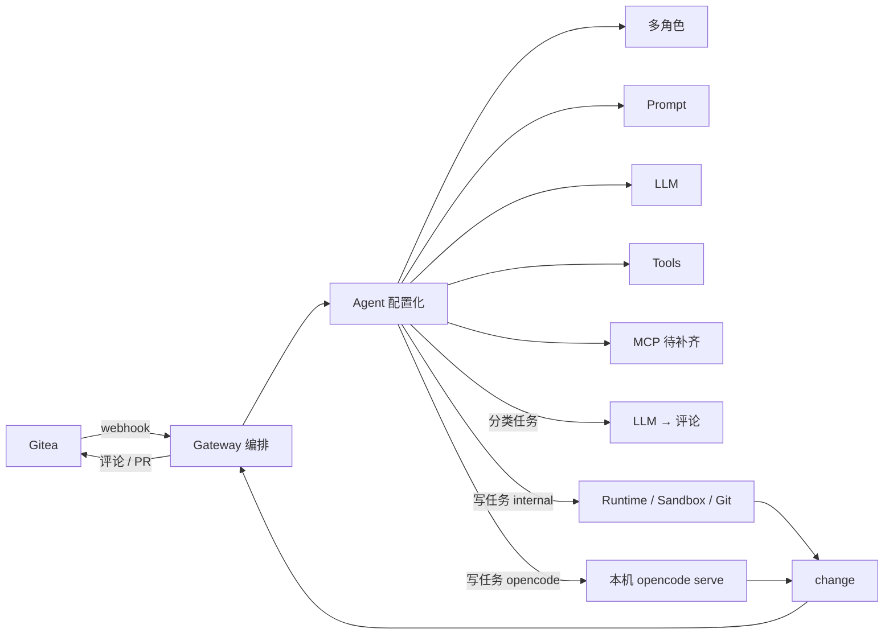

# 服务器端 Agent 运行时设计（Server Runtime Design）v4

> 状态：**Path A 已落地**（现行设计权威）；A+ 可选后续见 [TASKS.md](./TASKS.md)  
> 目标：锁定产品边界——**内置 Agent 默认保留**；**OpenCode 以本机 sidecar（HTTP）可选接入**；编排与执行分界清晰。  
> 部署目标：个人/小团队自用，已开源。Gateway 与 OpenCode **同机**为第一期硬约束。  
> 前身：[v3](./archived/20260714-server-runtime-design-v3.md) · [v2](./archived/20260714-server-runtime-design-v2.md) · [v1](./archived/20260714-server-runtime-design.md) · 早期 CLI 方案：[archived/20260710-opencode-integration.md](./archived/20260710-opencode-integration.md)  
> Path A 实施清单（已归档）：[archived/20260714-todo-opencode-path-a.md](./archived/20260714-todo-opencode-path-a.md) · 字段笔记：[archived/20260715-opencode-a0-notes.md](./archived/20260715-opencode-a0-notes.md)

---

## 0. 相对 v3 的变更（决策级）

| 项 | v3 | v4 |
|----|----|----|
| 产品定位 | 偏 Runtime/CLI 接入细节 | **编排中枢**：Gateway ≠ 服务端 OpenCode |
| 默认能力 | 强调外部 CLI | **`backend=internal` 永远默认、开箱不变** |
| OpenCode 接入 | ExternalCLIRunner（CLI 扫输出优先） | **`opencode serve` HTTP/OpenAPI 优先**；CLI `run` 仅降级 |
| 部署范围 | 含远程意向 | **第一期仅本机 sidecar**；远程明确非目标 |
| 配置演进 | Skill/Workspace 并列 | **Prompt 包 / 工具包可复用**（借鉴 ai-git-bot）；MCP 扩工具 |
| CLI Runner 清单 | 主实施路径 | 降级为 appendix；主路径改为 OpenCodeHttpBackend |

---

## 1. 产品边界（冻结）

### 1.1 我们是什么 / 不是什么

| 是 | 不是 |
|----|------|
| Gitea（等）上的 **Agent 编排与写回**：Webhook、Assign、门禁、Session、队列、评论/PR | 再造一套完整 Coding IDE / OpenCode |
| **可配置多角色 Agent**（提示词、模型、工具），开箱用内置 Loop | 强制用户安装/运维外部 coding 引擎才能跑通 |
| **可选**把重编码外包给成熟引擎（OpenCode） | 第一期就支持任意远程 OpenCode + 跨机 workspace |

### 1.2 不可谈判约束

1. **内置轻量 Agent 必须保留** — 与「用户自定义 Agent / 写提示词」同级，是默认路径。  
2. **Analyze / Review / Reply 只走 `internal`** — 不绑定 OpenCode。  
3. **OpenCode = 可选加强 coder** — 按 Agent（或写任务类型）开启。  
4. **Gateway 管编排与 Git 写回**；改码大脑可外包。  
5. **Runtime 变重 / 分进程部署** 是 `internal` 自己的演进题，与是否接 OpenCode **正交、后做**。  
6. **第一期 OpenCode 仅本机 sidecar**（`127.0.0.1` 或同机 Unix socket）；不做远程与跨机 sync。

### 1.3 非目标（明确不做）

- 远程 `opencode serve`（无 shared_fs / sync）  
- Firecracker / 完整 Docker EnvSpec / bare mirror+worktree（Path B，另文）  
- ai-git-bot 式全套 E2E + DeploymentStrategy  
- 盲对接 CLI、解析人类可读终端日志作为唯一集成面  
- 把 Gateway Agent UI 镜像成 OpenCode 侧完整 Agent 市场

---

## 2. 当前架构草图（与代码对齐）



### 2.1 任务路径分流

| 任务类型 | Runner | Coding Backend | 是否进 Sandbox/Git |
|----------|--------|----------------|---------------------|
| analyze_issue / trigger | AnalyzeRunner | 强制 `internal` | 否 |
| review_pr | ReviewRunner | 强制 `internal` | 否 |
| reply_comment | InteractionRunner | 强制 `internal` | 否（读评论历史） |
| solve_issue / solve_comment / fix_bug | Dev/Bugfix 路径 | `internal`（默认）或 `opencode-*` | 是 |

### 2.2 职责分界

```
编排层（Gateway，继续演进）
  webhook → Resolver → Gate → Workflow → Session → Queue → Executor → Runner
  拥有：事件语义、阶段、Session TTL/LRU、幂等、Gitea 回写

执行层（按 backend 选择）
  internal : prepareWorkspace → AgentLoop(+Tools/MCP) → finalizeGit
  opencode : prepareWorkspace → HTTP(opencode serve) → finalizeGit
```

| 反模式 | 正确做法 |
|--------|----------|
| OpenCode 直接 PostComment | Gateway Executor / Runner 写回 |
| Runtime 解析 Webhook | 编排写入 `task.Context`，执行层只消费 prompt |
| 远程 OpenCode 无共享目录 | 第一期禁止；后期再定 `workspace_mode` |

---

## 3. CodingBackend 模型

### 3.1 接口（概念）

```go
// internal/agents/coding_backend.go（第一期引入）
type CodingBackend interface {
    Name() string
    // 在已准备好的 workDir 上执行改码；不负责 clone/push/PR
    Run(ctx context.Context, req CodingRequest) (*CodingResult, error)
    Abort(ctx context.Context, handle string) error // opencode: POST /session/:id/abort；internal: cancel ctx
}

type CodingRequest struct {
    WorkDir          string
    Prompt           string
    SystemPrompt     string // Gateway Agent.system_prompt 注入
    SessionID        string // Gateway session；映射到 OpenCode session
    Continue         bool
    Model            string // 可选；映射失败则用服务端默认
    Timeout          time.Duration
    BackendOptions   map[string]any
}

type CodingResult struct {
    Summary    string
    Success    bool
    // 改动以磁盘为准：finalize 侧 HasChanges()；后端可附带 diff 摘要
    RemoteSessionID string
}
```

| 实现 | 用途 |
|------|------|
| `InternalCodingBackend` | 包装现有 `AgentLoop` + `DefaultTools` |
| `OpenCodeHTTPBackend` | Path A 主交付：同机 `opencode serve` |
| `OpenCodeCLIBackend` | 可选降级：`opencode run`（非默认） |

`runWriteTask` 重构为：

```
prepareWriteWorkspace → CodingBackend.Run → finalizeWriteChanges
```

`GetRunner` **不必**为 opencode 再造平行 Runner；仍走 Dev/Bugfix，仅在写路径中切换 backend。

### 3.2 Backend 解析规则

```
1. 非写任务 → 忽略 agent.backend，强制 internal（短路，根本不进入 CodingBackend）
2. 写任务：agent.Backend ≠ "" → 用该值
3. 否则 agents.backends.default（缺省 "internal"）
4. 配置中找不到对应 backend 项 → 失败并回写评论（勿静默降级，避免「配了没用」难查；可选配置 allow_fallback_internal: true）
```

---

## 4. Path A：内置 + 本机 OpenCode sidecar

### 4.1 部署拓扑（第一期唯一支持）

```
同机
┌─────────────────────────────────────────────┐
│  Gateway 进程                                │
│    sessions/{id}/repo/  ←── workspace 路径   │
│         │                                    │
│         │ HTTP 127.0.0.1:4096                │
│         ▼                                    │
│  opencode serve（sidecar，运维自行拉起）       │
│    directory = sessions/{id}/repo 绝对路径     │
└─────────────────────────────────────────────┘
```

- Gateway **不托管** opencode 进程生命周期（文档说明：systemd / docker compose / 手工）。  
- 可选：健康检查 `GET /global/health`；失败则任务 FAILED + Issue 评论。  
- Auth：`OPENCODE_SERVER_PASSWORD` → HTTP Basic。

### 4.2 OpenCode 集成面（正确方式）

优先顺序：

1. **HTTP + OpenAPI**（`opencode serve`，`/doc`）— **Path A 默认**  
2. SSE `/event` — 进度（Path A+）  
3. `opencode run` CLI — 仅降级 / 无 serve 时  
4. ACP — 不做（IDE 协议）

典型调用序列：

```
POST /session                    → session.id  （可与 Gateway session 标题关联）
POST /session/:id/message        → parts + system（注入 Gateway system_prompt）
  body 指定工作目录 / 使用实例 directory（以 OpenCode 版本为准，对接前用 /doc 核对）
GET  /session/:id/diff（可选）   → 变更摘要
POST /session/:id/abort          → 超时/用户取消
```

Gateway Session Continue：

- 同 Session 复用 `WorkspacePath` + OpenCode `session`（存 `backend_options` 或 session 扩展字段映射 `opencode_session_id`）。  
- 无映射则新建 OpenCode session，但仍复用磁盘工作区。

### 4.3 Agent 配置如何映射到 OpenCode

Gateway **Agent 仍是唯一用户配置入口**；不在 OpenCode 再维护平行 Agent CRUD。

| Gateway Agent 字段 | `internal` | `opencode-*` |
|--------------------|------------|--------------|
| `system_prompt` | Loop system | 注入 message.`system` 或首条指令 |
| `provider` / `model` | llm.Registry | 映射为 OpenCode model；失败 WARN + 服务端默认 |
| `loop_config` | 生效 | **忽略**（UI 灰掉并注明） |
| `role` | 编排 | coder 才允许选 opencode |
| `backend` | `internal` | `opencode-local` 等 backends 名 |
| `backend_options` | 无 | 见下 |

```json
{
  "backend": "opencode-local",
  "backend_options": {
    "inject_system_prompt": true,
    "opencode_model": "",
    "opencode_agent": "",
    "opencode_session_id": ""
  }
}
```

### 4.4 配置 schema（Path A）

```yaml
agents:
  defaults:
    provider: deepseek
    model: deepseek-chat
  backends:
    default: internal

    internal:
      type: builtin

    opencode-local:
      type: opencode_http
      base_url: "http://127.0.0.1:4096"
      auth:
        username: opencode
        password: "${OPENCODE_SERVER_PASSWORD}"
      timeout: "45m"
      workspace_mode: matea_path   # 第一期唯一合法值
      health_check:
        path: /global/health
        interval: 30s
      # 失败时是否回退 internal（默认 false：显式失败）
      allow_fallback_internal: false
```

Agent 表新增：

```text
backend TEXT DEFAULT 'internal'
backend_options TEXT  -- JSON
```

### 4.5 写任务执行流程（目标态）

```
DevRunner / BugfixRunner
  │
  ├─ prepareWriteWorkspace()     # Session 复用 / clone / branch（现有逻辑抽取）
  ├─ buildWritePrompt()          # BuildDevPrompt / Bugfix + MergeAgentSystemPrompt
  ├─ codingBackend.Run(...)      # internal Loop 或 OpenCode HTTP
  └─ finalizeWriteChanges()      # HasChanges → commit / push / PR / saveSessionBranch
```

OpenCode 路径：**以工作区磁盘 diff 为准**决定是否 commit；HTTP 返回的 summary 仅作评论素材。

---

## 5. Session vs Workspace（冻结）

| 模式 | 目录 | 使用条件 |
|------|------|----------|
| Session Workspace | `{base}/sessions/{session_id}/repo` | 有 `task.SessionID` 且路径已设（coder Continue） |
| Task Workspace | task 级目录 | 无 Session |

规则：

1. **有 Session → 禁止再开独立 worktree**（Path B 亦不打破 Continue）。  
2. OpenCode `directory` / 工作目录 = Session（或 Task）工作区**绝对路径**。  
3. bare mirror + worktree = Path B 基础设施，仅规划；**有 Session 时仍绑固定路径**。

---

## 6. 配置演进（借鉴，不阻塞 Path A）

学 **ai-git-bot**：组合配置；学 **wshm**：重编码可外挂。

### 6.1 近期（可与 Path A 并行设计，实施可稍后）

| 项 | 说明 |
|----|------|
| Prompt 按任务拆分 | 避免单字段塞满 analyze/coder/review；可先 DB/JSON 多字段或独立 Prompt 包实体 |
| 工具包可复用 | `ToolPack`（内置工具白名单）← Agent 引用；替换「全局 DefaultTools」硬绑 |
| MCP | **远程 MCP** 优先（部署友好）；stdio MCP 可选本机；扩的是工具，不是 Runtime |

### 6.2 Path A 不做完整拆分时的最小兼容

- Path A 可继续用现有单个 `system_prompt` + `DefaultTools`。  
- 文档与 API 预留 Prompt 包 / ToolPack 引用字段，避免二次迁移痛苦。

---

## 7. Path A 实施清单（文件级）

> 预估：**6–10 个工作日**（含 PoC 与测试）。默认 `internal` 行为零回归。

### Step 0 — PoC（0.5–1 天，可先于代码合并）

- [ ] 本机启动 `opencode serve --port 4096`  
- [ ] 对一临时 git 目录：create session → message → 确认文件变更  
- [ ] 记录实际请求字段（directory / system / model）写入本仓库 `docs/notes/` 或附录  

### Step 1 — 配置与存储（1 天）

| # | 文件 | 内容 |
|---|------|------|
| 1.1 | `internal/config/schema.go` | `AgentBackendsConfig`, `BackendConfig`（`opencode_http` / `builtin`） |
| 1.2 | `internal/config/config.go` | 加载、默认 `internal` |
| 1.3 | `config.example.yaml` | `opencode-local` 示例 |
| 1.4 | `internal/store/agent.go` | `Backend`, `BackendOptions` |
| 1.5 | `internal/store/sqlite.go` | migration 默认 `internal` |
| 1.6 | `internal/api/...` | CRUD 暴露字段 |

### Step 2 — 抽取 write helpers（1–2 天，零行为变更）

| # | 文件 | 内容 |
|---|------|------|
| 2.1 | `internal/agents/write_workspace.go` **新增** | `prepareWriteWorkspace` / `finalizeWriteChanges` |
| 2.2 | `internal/agents/runners.go` | `runWriteTask` 改为调用 helpers + `InternalCodingBackend` |

独立 PR，全量测试绿。

### Step 3 — OpenCode HTTP Backend（2–3 天）

| # | 文件 | 内容 |
|---|------|------|
| 3.1 | `internal/agents/coding_backend.go` | 接口 + 工厂 `ResolveCodingBackend` |
| 3.2 | `internal/agents/opencode_http.go` | session/message/abort/health 客户端 |
| 3.3 | `internal/agents/runners.go` | 写任务按 backend 选择实现 |
| 3.4 | `internal/dispatcher/executor.go` | 若需按 agent 决策，传入 agent（与现有 GetRunner 协调） |

验收：配 `backend=opencode-local` 的 coder Agent，Issue Assign → 工作区有变更 → PR；`backend=internal` 回归通过。

### Step 4 — 测试与运维说明（1–2 天）

| # | 内容 |
|---|------|
| 4.1 | httptest mock OpenCode `/session` `/message` |
| 4.2 | 集成：mock server + 假仓库 |
| 4.3 | `docs/ARCHITECTURE.md` + 运维：如何起 sidecar、健康检查、密码 |
| 4.4 | WebUI：Agent 下拉 backend（可 API-only 首发） |

### Step 5 — Path A+（可选）

- [ ] SSE 进度 → 周期性 Issue 评论或 task progress  
- [ ] 持久化 `opencode_session_id` 到 Session  
- [ ] `allow_fallback_internal`  
- [ ] Claude `-p --output-format json` 作为第二外部 backend（契约型 CLI，非盲扫）

---

## 8. 路线图总览

```
Path A（当前）── 产品价值
  A0  OpenCode serve PoC
  A1  backends 配置 + Agent.backend
  A2  write helpers 抽取
  A3  OpenCodeHTTPBackend
  A4  测试 / 文档 / UI
  A+  SSE 进度 / session 映射 / Claude PrintBackend

Path A2（配置卫生，不阻塞 A）
  Prompt 包按任务拆分
  ToolPack + MCP 远程白名单

Path B（基础设施，后置）
  无 Session 任务的 worktree / bare mirror
  三级 Scheduler、Host InstallDeps
  internal Loop 进程外隔离（若空间占用成痛点）

Path C（按需）
  远程 OpenCode + shared_fs / sync
  Docker ExecutionBackend
  L2 项目记忆
```

---

## 9. 风险与缓解

| # | 风险 | 缓解 |
|---|------|------|
| 1 | OpenCode API 字段随版本变 | PoC 钉版本；客户端集中在 `opencode_http.go`；对照 `/doc` |
| 2 | sidecar 未启动 | health 失败 → 明确评论；不静默吃掉任务 |
| 3 | system_prompt / model 映射不符合预期 | UI 注明「部分由 OpenCode 接管」；日志打 WARN |
| 4 | refactor 写路径回归 | Step 2 独立 PR；强制 `internal` 回归测试 |
| 5 | 误做成远程 | `workspace_mode` 非 `matea_path` 直接拒绝加载 |
| 6 | 项目变重 | 禁止 Path B/C 与 A 捆绑交付 |

---

## 10. 验收标准（Path A Done）

1. 默认配置下，现有 Analyze / Review / Dev（internal）行为与 v4 前一致。  
2. 可选：coder Agent `backend=opencode-local`，本机 sidecar 可用时，完成 Issue→改码→PR。  
3. sidecar 宕机时，任务失败原因可读（评论或 task.error）。  
4. Analyze/Review Agent 即使误配 backend，也不走 OpenCode。  
5. Session Continue：第二次写任务复用同一 `WorkspacePath`；OpenCode 侧尽量续 session。  
6. 文档说明如何启动 `opencode serve` 与环境变量。

---

## 11. 相关文档

| 文档 | 关系 |
|------|------|
| [ARCHITECTURE.md](./ARCHITECTURE.md) | 现状实现 |
| [archived/20260714-server-runtime-design-v3.md](./archived/20260714-server-runtime-design-v3.md) | 编排边界 / Session·worktree；CLI 清单作历史参考 |
| [archived/20260714-server-runtime-design-v2.md](./archived/20260714-server-runtime-design-v2.md) | 长期 Runtime 愿景（Path B/C） |
| [archived/20260714-server-runtime-design.md](./archived/20260714-server-runtime-design.md) | v1 初稿（已归档） |
| [archived/20260710-opencode-integration.md](./archived/20260710-opencode-integration.md) | 早期 OpenCode 规划（CLI 主路径，已废弃） |
| [archived/20260714-todo-opencode-path-a.md](./archived/20260714-todo-opencode-path-a.md) | Path A 实施清单（已归档；A+ 见 TASKS） |

---

## 12. Path A Checklist（可建 Issue）

```
[ ] A0 本机 opencode serve PoC + 记录 API 字段
[ ] A1 config backends + Agent.backend / backend_options + migration
[ ] A2 write_workspace helpers（零行为变更 PR）
[ ] A3 CodingBackend 接口 + Internal + OpenCodeHTTP
[ ] A3 写任务路由；非写任务强制 internal
[ ] A3 health check + 失败评论
[ ] A4 mock 单测 / 集成测试
[ ] A4 ARCHITECTURE + sidecar 运维说明
[ ] A4（可选）WebUI backend 选择
[ ] A+ SSE / opencode_session_id / Claude PrintBackend
```
