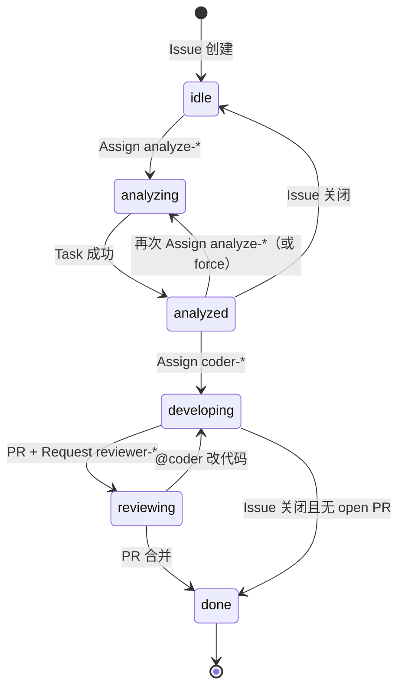
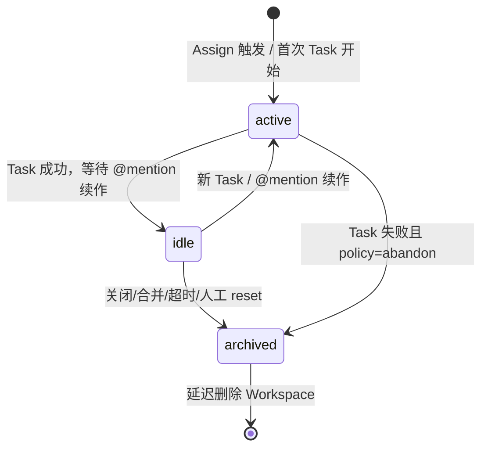

# 触发规则与工作流改进方案

> 本文档整理自触发规则评估、实际研发场景讨论及与 ai-git-bot / wshm 等项目的对比，作为后续实现的参考。
> 相关文档：[gitea-ai-agent-design.md](./gitea-ai-agent-design.md)、[ARCHITECTURE.md](./ARCHITECTURE.md)

## 一、背景与目标

Gitea Agent Gateway 通过 Webhook 将 Gitea 事件路由到 AI Agent。当前实现依赖 `routes` 表 + Label 条件匹配，存在路由与行为脱节、无会话续作等问题。

**目标**：让 AI Agent 与 Gitea 工作流更顺畅、更符合直觉。

**设计决策（v2）**：**全面拥抱 Assign** —— 在 Gateway 中配置多个功能性 Agent（如 `analyze-007`、`coder-ds`、`coder-claude`、`reviewer-gpt`），用户在 Issue / PR 上 **Assign 对应成员** 即可触发；评论中 **@mention** 用于续作与修正。

**核心原则**：

- **Assign 为主、@Mention 续作**：与 Gitea「把人分给任务」的习惯一致，不依赖自定义阶段标签
- **全面拥抱 Assign，弃用 Label 触发**：v2 **不提供** `ai:analyze` / `labeled` 等阶段标签触发，亦不做兼容映射；旧配置需迁移为 Assign
- **Gateway 持有阶段真相**：Gitea 允许多 Assignee、多 Label；**阶段互斥与 Session 归属由 Gateway 状态机维护**，不从 Gitea 快照推断
- **顺序可配置、不可则拦**：结构性依赖内置（L1）；流程顺序交给 Repo 级门禁（L2）；Agent 评论引导下一步（L3）
- **功能性 Agent + Role**：同一 Role（analyze / coder / review）可配置多个 Agent（不同 Provider/Model）
- **只读与读写分离**：analyze / review 与 coder 使用不同 Runner，后果不同
- **Session 可续作**：Task 结束不立即销毁工作空间与对话上下文，支持 PR 上 @coder 改代码

---

## 二、当前实现评估

### 2.1 触发规则模型（现状）

| 维度 | 当前实现 |
|------|----------|
| 匹配条件 | `event` + `action` + `label` + `assignee` + `mention` |
| 选 Agent | Route 命中 → `agent_id` |
| 选行为 | `determineTaskType()` 硬编码，与 Route 分离 |
| 会话 | 无；每 Task 独立 sandbox，`defer Cleanup()` |
| 阶段状态 | 无 WorkflowContext |

### 2.2 主要缺口（相对 v2 目标）

| 问题 | 影响 |
|------|------|
| Label 驱动与 Assign 驱动混用 | 用户困惑；assign + label 双 webhook 重复任务 |
| 无 WorkflowContext | 多 Assignee / 多 Label 时无法判断「当前阶段」 |
| 无 AgentSession | @mention 无法可靠续作；每次 dev 任务重新 clone |
| 路由与行为脱节 | 配了 Route 不等于执行预期 Runner |
| 无 sender 过滤 / Issue 级去重 | 循环回复、并发重复入队 |
| Agent 无 `role` 字段 | 无法从 Registry 直接映射 analyze/coder/review |

---

## 三、典型研发场景（Assign 驱动）

### 3.1 Feature Issue

```
1. PM 创建 Issue（可选业务标签 feature）
2. Assign analyze-007           → 需求分析，发评论报告
3. 评论 @analyze-007 修正方案   → 只读续作（复用 Session S1）
4. Assign coder-ds              → 写代码、提 PR #88（Session S2 + Workspace W2）
5. PR 上 Request Reviewer reviewer-gpt → 审查报告
6. 评论 @coder-ds 改命名        → Dev 续作（复用 S2 + W2）
7. 人工合并 PR                  → 归档 Session，回收 Workspace
```

### 3.2 Bug Issue

与 Feature 相同。区别仅在于 Issue 上的业务标签 `bug` → coder Agent 使用 Bugfix 系 Prompt，**无需**单独触发标签或不同 Assign 流程。

### 3.3 修正与续作（@Mention）

```
"@analyze-007 方案改为 Redis"     → AnalyzeRunner，Session S1，只读
"@coder-ds 按上面改一版"           → 若 S2 有 branch/PR → DevRunner 续作 push
未 @ 任何人                        → fallback：WorkflowContext.active_agent 或 last_session
```

---

## 四、功能性 Agent 模型

### 4.1 Gateway Agent 注册表

在 Web UI / API 中配置多个 Agent，每个 Agent 对应一个 Gitea 虚拟成员：

| 名称 | gitea_username | role | provider / model | 用途 |
|------|----------------|------|------------------|------|
| analyze-007 | analyze-007 | `analyze` | deepseek / … | 需求/Bug 分析 |
| coder-ds | coder-ds | `coder` | deepseek / … | 实现、提 PR |
| coder-claude | coder-claude | `coder` | anthropic / … | 同上，不同模型 |
| reviewer-gpt | reviewer-gpt | `review` | openai / … | PR 审查 |
| reviewer-ds | reviewer-ds | `review` | deepseek / … | 同上 |

**Role → Runner 映射（固定）**：

| role | Runner | 读写 |
|------|--------|------|
| `analyze` | AnalyzeRunner | 只读 |
| `coder` | DevRunner | 读写 |
| `review` | ReviewRunner | 只读 |

**Role 决定做什么；Assign 谁决定用哪个 Provider/Prompt 实例。**

### 4.2 触发方式总览

| 触发 | 事件 | 解析逻辑 |
|------|------|----------|
| **Assign Agent**（主） | `issues.assigned` | 若 `assignee` ∈ Registry → 按 role 转换 stage、入队 |
| **Request Reviewer** | `pull_request.review_requested` 等 | 若 reviewer ∈ Registry 且 role=review → 审查 |
| **@Mention**（续作） | `issue_comment.created` | 解析 @username → 查 Session / WorkflowContext |

v2 **不再处理** `issues.labeled` / `pull_request.labeled` 作为 Gateway 触发源。Gitea 仍可能发送此类 Webhook，Gateway 接收后直接忽略（或仅 debug 日志）。

### 4.3 与 Label 的关系

- **业务标签**（`feature` / `bug` / `backend`）：可读入 Issue/PR 上下文，影响 **Prompt 选择**，**不触发** Gateway
- **阶段标签**（`ai:analyze` / `ai:solve` / `ai:dev` / `ai:review` 等）：v2 **完全弃用**，不解析、不映射、不兼容
- Gitea 上可同时存在多个 Label、多个 Assignee；**Gateway 不以 Label 为触发或阶段依据**

---

## 五、WorkflowContext（阶段真相）

### 5.1 为何需要

Issue 可 Assign 多人、打多个 Label。若 Router 仅做「assignee 在列表中则命中」，会导致：

- 一次 assign 误触发多个 Agent
- 历史 Assignee 残留导致重复触发
- @mention 时不清楚接 analyze 还是会话还是 coder

**结论：阶段由 Gateway 的 WorkflowContext 维护，Gitea 视图仅为 UI。**

### 5.2 数据模型

```go
// 粒度：repo + issue_number（PR 审查可用 repo + pr_number 或 linked issue）
type WorkflowContext struct {
    ID            int64
    Repo          string    // owner/repo
    IssueID       int
    PRID          int       // 0 表示尚未关联 PR
    Stage         string    // idle | analyzing | analyzed | developing | reviewing | done
    ActiveAgentID int64     // 当前阶段负责的 Agent
    ActiveRole    string    // analyze | coder | review
    SessionID     string    // 绑定 AgentSession（coder/analyze 续作）
    UpdatedAt     time.Time
}
```

#### 5.2.1 Issue 与 PR 的 Context 键

| 场景 | WorkflowContext 键 | 说明 |
|------|---------------------|------|
| Issue 工作流（主路径） | `(repo, issue_id)` | Feature / Bug 从 Issue 创建到 PR |
| PR 审查 | 同上，**必须解析 linked Issue** | `review_requested` 时查 PR 关联 Issue（如 `Fixes #N`、Gitea API）；更新同一 Context 的 `pr_id` |
| 无 Issue 的纯 PR | `(repo, issue_id=0, pr_id)` | 扩展唯一索引为 `(repo, issue_id, pr_id)` 或 `(repo, pr_id)` 备用表；P0 可先要求团队「PR 必须关联 Issue」 |

阶段转换前统一走 **EvaluateGate(from, to, role, ctx)**；通过后再更新 WorkflowContext 并入队。

### 5.3 阶段定义

| stage | 含义 | 典型 ActiveRole |
|-------|------|-----------------|
| `idle` | 新建 Issue，未启动 Agent | — |
| `analyzing` | 分析任务进行中或刚完成待确认 | analyze |
| `analyzed` | 分析已完成，可进入开发 | analyze |
| `developing` | 编码/修复进行中或已有 open PR | coder |
| `reviewing` | PR 审查进行中 | review |
| `done` | Issue 关闭或 PR 已合并 | — |

### 5.4 Assign 触发的阶段转换

解析 **`issues.assigned`** 时只认 **本次 webhook 的 assignee**（非 assignees 全量列表）：

| assignee.role | 当前 stage | 动作 |
|---------------|------------|------|
| analyze | idle, analyzed, done | → analyzing，ActiveAgent=该 Agent，创建/复用 Session |
| analyze | analyzing（Task 进行中） | in-flight / pending Task → 跳过；否则按 `rerun_same_stage` policy |
| analyze | developing, reviewing | 由 **WorkflowPolicy**（`reanalyze_while_developing` 等）决定 off / soft / hard |
| coder | idle, analyzed | → developing（`idle` 直接 coder 是否允许见 §5.7 `allow_skip_analyze`） |
| coder | developing（同 Agent） | 若已有 running task → 跳过；否则按 `rerun_same_stage` 允许重跑 |
| coder | developing（换 Agent） | 新 Session 或排队；Policy `coder_switch_agent` |
| coder | reviewing | @coder 续作 → developing；再次 Assign coder → 按 `rerun_same_stage` |
| review | —（Issue assign） | **无 effect**；L1 可选评论「请在 PR 上 Request Reviewer」 |
| review | PR `review_requested` 等 | → reviewing，ActiveAgent=reviewer，创建/复用 review Session |
| * | PR merged / Issue closed | → done（见 §7.3） |

**PR 审查**：`pull_request` + `review_requested` / opened 且 bot 在 reviewers 中 → stage=reviewing，Task review_pr。是否必须先「coder 完成」见 §5.7（默认：不要求，有 open PR 即可）。**WorkflowContext 始终按 linked Issue 定位**（PR 事件通过 Gitea API 或 payload 解析关联 Issue #）；若无关联 Issue（纯 PR 工作流），使用 `(repo, pr_id)` 作为辅助键，`issue_id=0`，见 §5.2.1。

**Task 完成后的 stage 更新**（Runner 回调，非 Assign 事件）：

| Task 类型 | 成功回调 |
|-----------|----------|
| analyze_issue | analyzing → analyzed |
| solve_issue / fix_bug | 保持 developing；写入 `pr_id`、Session.branch |
| review_pr | 保持 reviewing（允许重复 Request Reviewer 重跑审查） |
| reply_comment / solve_comment | stage 不变 |

**`issues.unassigned`**：Gateway **不处理**（不触发 Task、不回退 stage）；阶段真相以 WorkflowContext 为准，Gitea Assignee 列表仅作 UI 参考。

### 5.5 阶段流转图



### 5.6 多 Assignee 的产品约定

1. **同一阶段只 Assign 一个 Agent 账号**（analyze *或* coder，不要同时 Assign 两个 Agent）
2. 人类成员可与 Agent 并存；**仅 Registry 中的 gitea_username 会触发 Gateway**
3. 换阶段：Assign 下一阶段 Agent；Gateway 校验 stage 转换
4. 可选（P2）：阶段切换时 Gateway 调用 Gitea API unassign 上一 Agent，保持 Issue 侧整洁

### 5.7 阶段顺序与门禁（WorkflowPolicy）

WorkflowContext 的 **互斥** 解决「同一时刻别冲突」；**顺序** 解决「阶段 B 是否允许在阶段 A 之前/之后进入」。二者分开设计。

**不需要** 全局 FIFO（跨 Issue 排队），也 **不需要** 写死「必须先 analyze 再 coder、必须先 coder 完成再 review」。推荐三层门禁：

```
┌─────────────────────────────────────────┐
│  L1 结构性（内置，不可关闭）             │
│  无前置物则不可能执行                    │
├─────────────────────────────────────────┤
│  L2 流程性（Repo 可配：off / soft / hard）│
│  团队规范：是否必须先 analyze 等         │
├─────────────────────────────────────────┤
│  L3 建议性（Agent 评论，不阻断）         │
│  提示推荐下一步 Assign / @ 谁            │
└─────────────────────────────────────────┘
```

#### 5.7.1 L1 — 结构性依赖（内置 hard）

与团队习惯无关，缺少前置条件则 **拒绝入队** 并评论说明：

| 规则 ID | 条件 | 行为 |
|---------|------|------|
| `l1.review_requires_pr` | role=review 且无 open PR / 无效 PRID | hard：不入队 |
| `l1.dev_push_requires_branch` | @coder 续作改代码但 Session 无 branch 且无 PR | hard：降级为只读回复，或拒绝 |
| `l1.review_on_closed_pr` | PR 已 closed/merged | hard：不入队 |
| `l1.assign_unknown_agent` | assignee 不在 Agent Registry | 忽略（非 Gateway Agent） |

**不** 内置「必须先 analyze 再 coder」「必须先 coder 成功再 review」——后者交给 L2。

**关于「coder 完成才能 review」**：默认 **不要求**。Review 绑定 PR 即可；WIP / 草稿 PR 的 early review 由 L2 可选约束（如 `review_warn_if_draft: soft`），不做全局 hard。

#### 5.7.2 L2 — 流程性门禁（可配置）

按 **Repo**（或全局默认 + Repo 覆盖）配置。每项取值：

| 模式 | 含义 |
|------|------|
| `off` | 不检查，Assign 即尝试入队 |
| `soft` | **入队**，Task 开始前或同时发 **警告评论**；可选要求评论 `/force` 才入队 |
| `hard` | **不入队**，仅 Agent 评论说明原因与建议下一步 |

**配置示例**（`config.yaml` 或 Web UI「工作流策略」）：

```yaml
workflow:
  # 预设：strict | standard | free（UI 一键切换，展开为下列项）
  preset: standard

  gates:
    # Issue：coder 前是否必须先 analyze（stage 曾到 analyzed）
    coder_requires_analyzed: off      # strict 预设 → hard

    # idle 直接 Assign coder（跳过 analyze）
    allow_skip_analyze: true          # false + coder_requires_analyzed: hard 等效「必须先 analyze」

    # developing 期间再次 Assign analyze
    reanalyze_while_developing: soft  # strict → hard

    # 同一 stage 重复 Assign 同一 Agent（重跑）
    rerun_same_stage: soft            # off=允许；hard=拒绝（除非 /force）

    # PR review
    review_requires_pr: hard          # 与 L1 一致，通常固定 hard
    review_warn_if_draft: off         # soft：草稿 PR 审查前警告

    # coder 换 Agent（coder-ds → coder-claude）
    coder_switch_agent: soft          # hard：拒绝，需 archive 后重来
```

**推荐默认值**（偏实用、少拦人）：

| 门禁项 | 默认 | 说明 |
|--------|------|------|
| `coder_requires_analyzed` | `off` | 紧急 fix / 小改可跳过 analyze |
| `allow_skip_analyze` | `true` | idle → coder 直接允许 |
| `reanalyze_while_developing` | `soft` | 允许重分析，但提醒打断开发 |
| `rerun_same_stage` | `soft` | 重复 Assign 提示，不默认 hard |
| `review_requires_pr` | `hard` | 与 L1 一致 |
| `review_warn_if_draft` | `off` | 需要时可开 soft |
| `coder_switch_agent` | `soft` | 换模型实例时提示 Session 边界 |

**预设模板**：

| 预设 | 适用 | 要点 |
|------|------|------|
| `free` | 个人 / 实验 | 全部 `off`，仅 L1 |
| `standard` | 默认团队 | 上表默认值 |
| `strict` | 正式项目 | `coder_requires_analyzed: hard`，`reanalyze_while_developing: hard` |

#### 5.7.3 L3 — 建议性评论（不阻断）

Task **成功完成** 或 **门禁 soft 通过** 后，Agent 可发 **下一步建议**（非强制顺序）：

```
✅ 分析完成（task #12）。

建议：确认无误后 Assign coder-ds 开始实现。
若需调整方案，请 @analyze-007 继续讨论。
```

```
⚠️ 已 Assign coder-ds，但尚未进行需求分析。
已按配置继续执行。若希望先分析，可先 Assign analyze-007。

（当 allow_skip_analyze=true 且 coder_requires_analyzed=soft 时）
```

L3 不参与 Gate 判定，仅提升可发现性；配置项可选：

```yaml
workflow:
  notify:
    on_analyze_done: true    # 建议 Assign coder
    on_coder_pr_opened: true # 建议 Request reviewer
    on_gate_soft: true       # soft 门禁时复述警告
    on_gate_hard: true       # hard 门禁时说明替代操作（必开）
```

#### 5.7.4 门禁判定流程

```
Assign / Review 事件
  → ResolveAgent + 目标 (stage, role)
  → L1.Check(ctx)           → fail → 评论(L3 硬提示) → return
  → L2.EvaluateGate(policy) → hard fail → 评论 → return
                           → soft      → 评论警告 → （可选 /force）→ continue
                           → off       → continue
  → 更新 WorkflowContext
  → 入队 Task
  → 评论：🔄 已开始（task #…, session …）
```

**`/force`（可选）**：评论 body 含 `/force`（如 `@coder-ds /force`）或在 Assign 触发的 **Issue/PR 评论**中附带 `/force`，在 **soft** 门禁下跳过警告直接入队；**hard** 与 L1 不可用 force 绕过。**不使用 Label**（与 §4.3 一致）。

#### 5.7.5 互斥、顺序、并发：各自负责什么

| 机制 | 负责 | 不负责 |
|------|------|--------|
| WorkflowContext.stage | 当前阶段、ActiveAgent | 跨 Issue 全局顺序 |
| WorkflowPolicy (L2) | 阶段转换是否允许 | 同一 Session 内 Git 并发写 |
| in-flight 锁 | 同 issue 同时只跑一个 Task | 用户 Assign 的时间先后 |
| AgentSession | 续作归属 | 强制 analyze→coder 时间线 |

**同一 Issue** 上：用户 Assign 顺序由人控制；Gateway 只校验 **转换合法性** + **并发互斥**，不维护跨阶段的全局队列。

#### 5.7.6 数据模型（可选持久化）

```go
// 全局默认 + 按 repo 覆盖，存 config 或 workflow_policies 表
type WorkflowPolicy struct {
    Preset                  string            // free | standard | strict
    Gates                   map[string]string // gate_id → off|soft|hard
    Notify                  NotifyPolicy
}

// Gate 评估结果
type GateResult struct {
    Allowed bool
    Level   string // pass | soft | hard
    Code    string // e.g. coder_requires_analyzed
    Message string // 用于评论模板
    Hint    string // 建议下一步：Assign analyze-007
}
```

---

## 六、AgentSession 与工作空间

### 6.1 分离两个概念

| 概念 | 存储 | 生命周期 |
|------|------|----------|
| **AgentSession** | SQLite | 跨多个 Task，支撑对话续作与 Git 元数据 |
| **Workspace** | 磁盘 `data/work/sessions/{session_id}/repo/` | 与 Session 绑定，coder 阶段长期保留 |

当前实现（每 Task `task_{id}` 目录 + 任务结束 `Cleanup()`）**将被替换**为 Session 级目录。

### 6.2 AgentSession 数据模型

```go
type AgentSession struct {
    ID            string    // UUID
    Repo          string
    IssueID       int
    PRID          int       // coder 产出 PR 后填入
    AgentID       int64
    Role          string    // analyze | coder | review
    Status        string    // active | idle | archived
    Branch        string    // coder：工作分支
    WorkspacePath string    // 磁盘路径；analyze 可为空
    LastTaskID    int64     // 最近一次 Task
    MessageCount  int       // 或关联 prompt_history
    LastActiveAt  time.Time
    CreatedAt     time.Time
}
```

**prompt / 对话历史**：复用或扩展 `prompt_history` 表，按 `session_id` 关联。

### 6.3 Task 执行时如何使用 Session

```
1. Event Resolver 确定 agent_id、role、task_type
2. session = GetOrCreateSession(repo, issue, agent, role)
3. 若 role=coder 且 session.WorkspacePath 存在：
     git pull / fetch branch，跳过全量 clone
   否则：
     clone 到 session 目录
4. Runner 执行，更新 session（branch、pr_id、LastActiveAt）
5. Task 成功 → session.Status=idle（等待续作），**不删除 Workspace**
```

DevRunner 已有 `task.BaseBranch` 用于 PR 续改；v2 改为从 **Session.Branch** 读取。

### 6.4 @Mention 与 Session 绑定

| 优先级 | 规则 |
|--------|------|
| 1 | 评论中显式 `@gitea_username` → 该 Agent |
| 2 | 无 @ → `WorkflowContext.ActiveAgentID` |
| 3 | 仍无 → 同 issue 最近 `active/idle` 的 Session |
| 4 | 无 Session → 评论提示「请先 Assign analyze-007 / coder-ds」 |

**行为判定**：

| 条件 | Runner |
|------|--------|
| role=analyze 或 stage ∈ {analyzing, analyzed} | AnalyzeRunner（只读） |
| role=coder 且 Session 有 Branch/PR | DevRunner（续作 push） |
| role=review 且在 PR 评论 | ReviewRunner 或只读讨论 |
| 评论含 `/dev` | 强制 DevRunner |
| 评论含 `/reply` | 强制只读 |

---

## 七、Session 与 Workspace 生命周期

### 7.1 原则

- **Task 结束 ≠ Session 结束**
- **Session 归档 ≠ 立即删盘**（延迟回收，便于排查与误操作恢复）

### 7.2 Session 状态机



### 7.3 销毁与归档触发条件

| 事件 | Session | Workspace 目录 | WorkflowContext |
|------|---------|----------------|-----------------|
| analyze Task 成功 | idle，**保留** | 无或忽略 | stage→analyzed |
| coder Task 成功（已提 PR） | idle，**保留** | **保留** | stage→developing，PRID 写入 |
| @mention 续作 | active → idle | 复用 | 不变 |
| **PR merged** | archived | 延迟删除（默认 24h） | stage→done |
| **Issue closed**（无 open PR） | archived | 删除 | stage→done |
| **PR closed 未合并** | archived 或 idle 7d | 保留 7d（可配置） | 不变或 done |
| **空闲超时**（如 7 天无 Task/comment） | archived | 删除 | 可选 → done |
| **磁盘压力** | — | LRU 清理 archived | — |
| **新 stage 换 role**（analyze→coder） | 新建 coder Session；analyze Session **archived** | coder 新建 | 更新 ActiveAgent |
| **`/gateway reset`（可选）** | 删除 | 立即删除 | → idle |

### 7.4 与 Gitea Webhook 挂钩

| Gitea 事件 | Gateway 动作 |
|------------|--------------|
| `issues.closed` | WorkflowContext→done；Schedule archive 关联 Session |
| `pull_request.closed` + merged | archive coder Session；延迟删 Workspace |
| `pull_request.closed` 未合并 | 保留 Session 7d（可配置） |
| `issues.reopened` | 可选：reactivate 最近 archived Session |

### 7.5 配置项（config.yaml 草案）

```yaml
session:
  idle_ttl: "168h"              # 7 天无活动则 archive
  workspace_retention: "24h"    # archived 后延迟删盘
  pr_closed_retention: "168h"   # PR 未合并关闭后保留
  max_disk_per_repo: "5GB"      # 超限 LRU
```

---

## 八、事件解析流水线（替代纯 Route 匹配）

v2 以 **Event Resolver** 为唯一主路径；**不再使用** `routes` 表。

```
Webhook Event
  → 1. sender 过滤（sender == 任意 Agent 账号 → 忽略）
  → 2. delivery 去重（已有）
  → 3. repo 范围（Agent.Repos）
  → 4. Event Resolver 分支解析（Assign / PR review / @mention）
  → 5. L1.Check → L2.EvaluateGate（hard fail → L3 评论 → return）
  → 6. 更新 WorkflowContext + GetOrCreateSession
  → 7. in-flight 锁 + pending/running Task 检查
  → 8. 入队 Task（带 session_id、role、task_type）
  → 9. 进度评论（🔄 已开始）
```

**task_type 由 Agent.role + 事件上下文 + 业务 Label 决定，不再硬编码在 determineTaskType()：**

| role | 事件 | task_type |
|------|------|-----------|
| analyze | assigned | analyze_issue |
| analyze | comment @ | reply_comment（只读） |
| coder | assigned（Issue 无 `bug` 标签） | solve_issue |
| coder | assigned（Issue 含 `bug` 标签） | fix_bug |
| coder | comment @ + 有 Session/PR | solve_comment |
| review | PR review_requested | review_pr |

---

## 九、并发、循环与乱序

### 9.1 Agent 自触发

| 机制 | 说明 |
|------|------|
| `sender == agent.gitea_username` | 忽略事件 |
| 评论 `<!-- gateway-agent -->` 隐藏标记 | 可选 |
| Prompt：回复不 @ 自己 | 辅助 |

### 9.2 重复 Assign / 重复入队

```
Assign 同一 Agent 且 stage 未变且 Session idle：
  IF 同 repo#issue 有 pending/running Task → 跳过，评论「处理中」
  IF stage=analyzed 且再次 Assign analyze → 需 policy：拒绝或 force 重跑

仅响应 assigned 事件的「本次 assignee」，不扫描 assignees 全列表。
```

### 9.3 多人操作与乱序 Assign

- **WorkflowContext** 保证同一时刻只有一个 ActiveRole 处于「进行中」语义
- **in-flight 锁**：`(repo, issue_id)` 或 `(session_id)` 防止并发双 Task
- **乱序 Assign**（未 analyze 先 coder、developing 中再 analyze）：由 **WorkflowPolicy L2** 配置 off / soft / hard，见 §5.7
- **结构性不可能**（无 PR 却 review）：**L1 hard**，与配置无关

### 9.4 等待体验

- Assign 后立即评论：`🔄 analyze-007 已开始（task #123，session sess_abc）`
- 完成：`✅ 分析完成。Assign coder-ds 开始开发。`
- Web UI：Issue 详情展示 stage / active agent / session 状态 / workspace 占用

---

## 十、Route 模型退役（v2 Breaking）

v2 以 **Event Resolver + Agent Registry（role）** 完全替代基于 `routes` 表的 Label/Assignee 手工路由。

| v1 | v2 |
|----|-----|
| `routes` 表 + Label 条件 | **删除** Label 匹配；表整体废弃或仅只读迁移 |
| `Router.Match` + `determineTaskType()` label 分支 | **删除**；task_type 由 `agent.role` + 事件决定 |
| Web UI「触发规则」页 + `ai:*` 快捷填充 | **删除**；改为 Assign Playbook + 工作流策略 |
| `issues.labeled` 触发 | **忽略** |
| PR Label 触发 review | **弃用**；改为 Request Reviewer |

**v2 不再保留 Route 配置入口。** @Mention 续作由 Event Resolver 内置解析，无需 per-agent Route 行。

迁移方式见 §十一。

---

## 十一、v2 弃用清单与迁移

### 11.1 代码与数据弃用范围

| 项 | v2 处理 |
|----|---------|
| `routes.label` 匹配 | 删除 |
| `Router.Match` 中 `HasLabel` / `label` 条件 | 删除 |
| `determineTaskType()` 中 `ai:solve` / `ai:fix` 等 label 分支 | 删除 |
| `issues.labeled` / `pull_request.labeled` 入队逻辑 | 删除（Webhook 可收，不触发 Task） |
| `HasLabel()` 仅服务 Route 时 | 删除或移入测试遗留清理 |
| API `POST/GET /api/routes` | 删除或 410 Gone |
| Web `TriggerRules.vue`、Agent 详情「触发规则」Tab | 删除 |
| README / Dashboard 中 `ai:analyze` 等阶段标签说明 | 改写为 Assign |
| `config.example.yaml` / 模板中 Label 触发示例 | 删除 |

**保留**：业务 Label 进入 LLM 上下文（Issue.Labels 只读）；Gitea 侧团队可继续用 Label 做项目管理，与 Gateway 触发无关。

### 11.2 从 Label 触发迁移到 Assign

| 旧操作（v1） | v2 操作 |
|--------------|---------|
| Issue 打 `ai:analyze` | Assign **analyze-*** |
| Issue 打 `ai:solve` / `ai:fix` / `ai:dev` | Assign **coder-*** |
| PR 打 `ai:review` | PR 上 **Request Reviewer** → **reviewer-*** |
| 路由表配 `labeled` + label | 删除；为每个 Agent 确保 Gitea 协作者 + Assign |
| @mention（不变） | 仍 @ Agent 的 `gitea_username` |

### 11.3 数据库迁移

- 现有 `routes` 表：迁移脚本导出备份后 **DROP** 或保留空表只读（推荐导出 JSON 后 DROP）
- 无自动把旧 Route 转为 Assign 的逻辑（用户按 §11.2 手工切换）

### 11.4 文档与 CHANGELOG

- CHANGELOG v2 明确 **Breaking**：移除 Label 触发与 routes API
- [gitea-ai-agent-design.md](./gitea-ai-agent-design.md) 标注 Label 规范段落 superseded by 本文档

---

## 十二、参考：同类项目对比（摘要）

| 维度 | ai-git-bot | wshm | **ai-dev v2（本文）** |
|------|------------|------|------------------------|
| 主触发 | Assign / Reviewer | 自动 + Slash | **Assign / Reviewer** |
| 阶段状态 | AgentSession | DB triage 缓存 | **WorkflowContext + AgentSession** |
| 续作 | Session + Workspace | Slash 重跑 | **Session 复用 + @mention** |
| 多 Agent | 多 Bot 账号 | 单 Bot | **多 Agent 账号 + role** |
| Label | 基本不用 | AI 输出用 | **仅业务标签** |

---

## 十三、实现路线图

### P0 — 状态机与 Assign 主路径

- [ ] Agent 表增加 `role`（analyze / coder / review）
- [ ] 新增 `workflow_contexts`、`agent_sessions` 表及 CRUD
- [ ] Event Resolver：`issues.assigned` 只认本次 assignee → role → Task
- [ ] sender 过滤 + `(repo, issue_id)` in-flight 锁
- [ ] PR `review_requested` → review Agent
- [ ] PR 关联 Issue 解析；业务标签 `bug` → `fix_bug` task_type
- [ ] **L1 结构性门禁**（review 需 PR、closed PR 拒绝等）+ hard 失败评论
- [ ] **弃用 Label 触发**：删除 `determineTaskType` label 分支；忽略 `labeled` 事件；移除 Router label 匹配

### P1 — Session 续作与 WorkflowPolicy

- [ ] DevRunner：Session 级 Workspace，Task 结束不 Cleanup
- [ ] @mention 解析 + Session 查找 + 行为判定（reply vs dev）
- [ ] WorkflowContext 与 Session 在 Task 完成后更新
- [ ] 进度评论（开始/完成）
- [ ] **WorkflowPolicy L2**：config + `EvaluateGate`；预设 free / standard / strict
- [ ] **L3 建议评论**：on_analyze_done、on_gate_soft/hard 模板
- [ ] 可选 `/force` 绕过 soft 门禁

### P2 — 生命周期与运维

- [ ] Issue closed / PR merged → archive Session + 延迟删 Workspace
- [ ] idle_ttl、workspace_retention 配置
- [ ] Web UI：Issue/PR 工作流状态面板；**删除**触发规则页
- [ ] 可选：阶段切换时 Gitea unassign 上一 Agent
- [ ] **routes 表/API/UI 完全移除**；DB 迁移 DROP routes；CHANGELOG Breaking

### P3 — 增强

- [ ] `/gateway reset`、force 重跑 policy
- [ ] 磁盘 LRU、max_disk_per_repo
- [ ] 创建 Agent 向导（按 role 模板）
- [ ] 组织级 / 多仓库 global 配置

---

## 十四、团队 Playbook（Assign 版）

### Feature / Bug

| 步骤 | 操作 | 预期 |
|------|------|------|
| 1 | 创建 Issue，可选 `feature` / `bug` | — |
| 2 | Assign **analyze-007** | 分析报告评论 |
| 3 | @analyze-007 讨论 | 只读续作 |
| 4 | Assign **coder-ds**（或 coder-claude） | 提 PR |
| 5 | PR 上 Request Reviewer **reviewer-gpt** | 审查评论 |
| 6 | @coder-ds 修改 | push 更新 PR |
| 7 | 合并 PR | Gateway 归档 Session |

### 注意事项

- 不要同时 Assign 两个 Agent（analyze + coder）
- 续作优先 @ 具体 Agent；不确定时 Gateway 用 active_agent 兜底
- 人类 Assignee 与 Agent Assignee 可共存，仅 Agent 账号触发自动化
- 流程顺序（是否必须先 analyze）在 **设置 → 工作流策略** 中配置，默认 `standard` 可跳过 analyze

### 工作流策略预设

| 预设 | 行为概要 |
|------|----------|
| **free** | 仅 L1；Assign 即跑 |
| **standard**（默认） | 跳过 analyze 允许；developing 中重 analyze 软警告 |
| **strict** | 必须先 analyze 再 coder；developing 中禁止重 analyze（hard） |

---

## 十五、与现有文档的关系

| 文档 | 关系 |
|------|------|
| [gitea-ai-agent-design.md](./gitea-ai-agent-design.md) | v3 Label 规范 **已 superseded**；v2 仅 Assign + 业务 Label |
| [ARCHITECTURE.md](./ARCHITECTURE.md) | 需补充 Event Resolver；**删除** Router/Label 触发描述 |
| [web-ui-design.md](./web-ui-design.md) | 删除触发规则页；Agent role + 工作流策略 + 状态面板 |

---

## 十六、总结

| 维度 | 现状 | v2 目标 |
|------|------|---------|
| 触发方式 | Label + Route 为主 | **仅 Assign / Request Reviewer / @Mention** |
| Agent 模型 | 通用 Agent + 手工 Route | **功能性 Agent（role + 多模型实例）** |
| 阶段判断 | 无 / 靠 Label 猜测 | **WorkflowContext** |
| 顺序约束 | 无 | **L1 内置 + L2 可配 + L3 评论** |
| 续作 | 无 Session | **AgentSession + Workspace 复用** |
| 销毁时机 | Task 结束即删 sandbox | **工作流结束 + TTL 延迟回收** |
| @Mention | Route mention 字段 | **@谁 → Session；行为看 role + 上下文** |
| Label | 阶段触发 | **不触发**；仅业务标签作 Prompt 上下文 |
| routes 表 / 触发规则 UI | 核心配置 | **v2 删除（Breaking）** |

**核心结论**：Gitea 的多 Assignee / 多 Label 不是 Gateway 的阶段来源。**Assign 触发 Who，WorkflowContext 定义 When，WorkflowPolicy 定义能不能转，AgentSession 支撑 Continue**；v2 **不兼容** Label 阶段触发，流程顺序交给 WorkflowPolicy 配置，Agent 在必要时评论引导。
